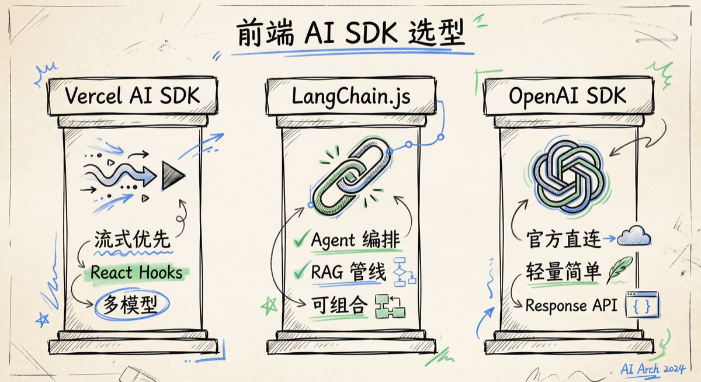
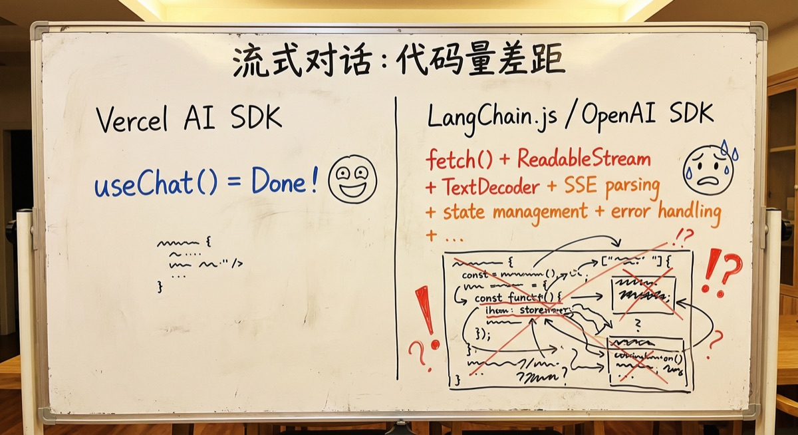
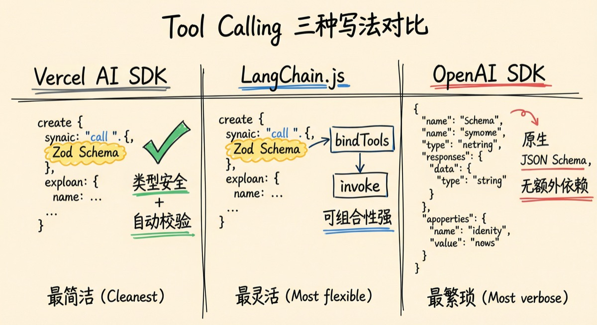
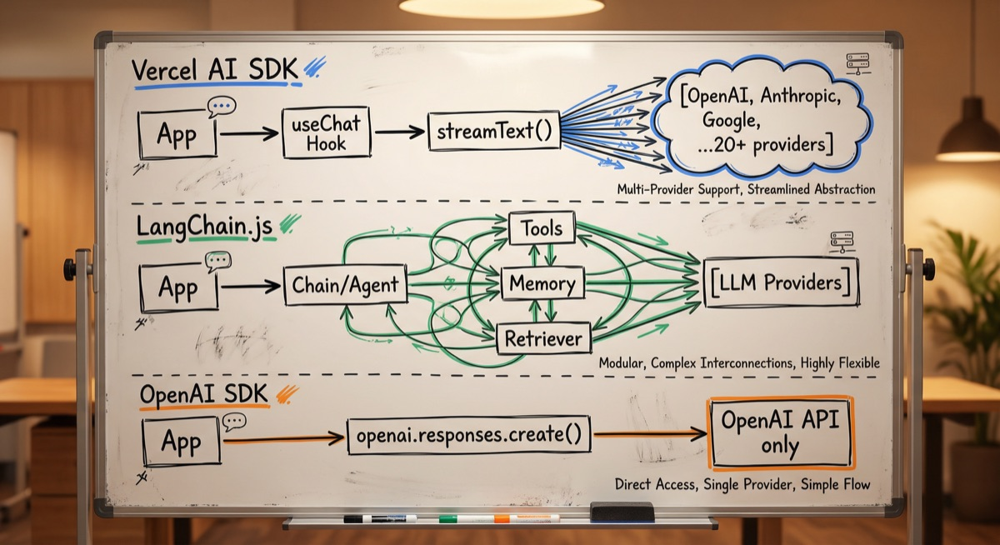
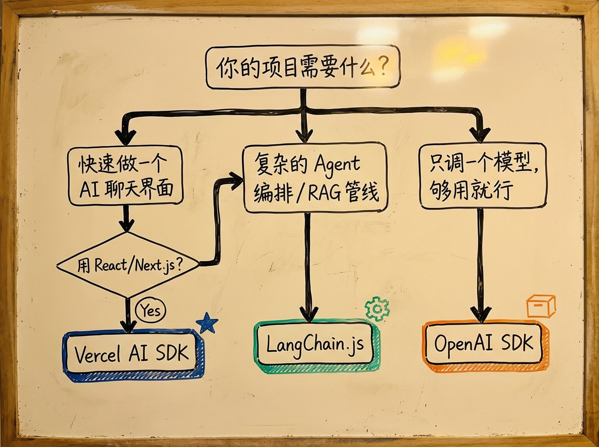
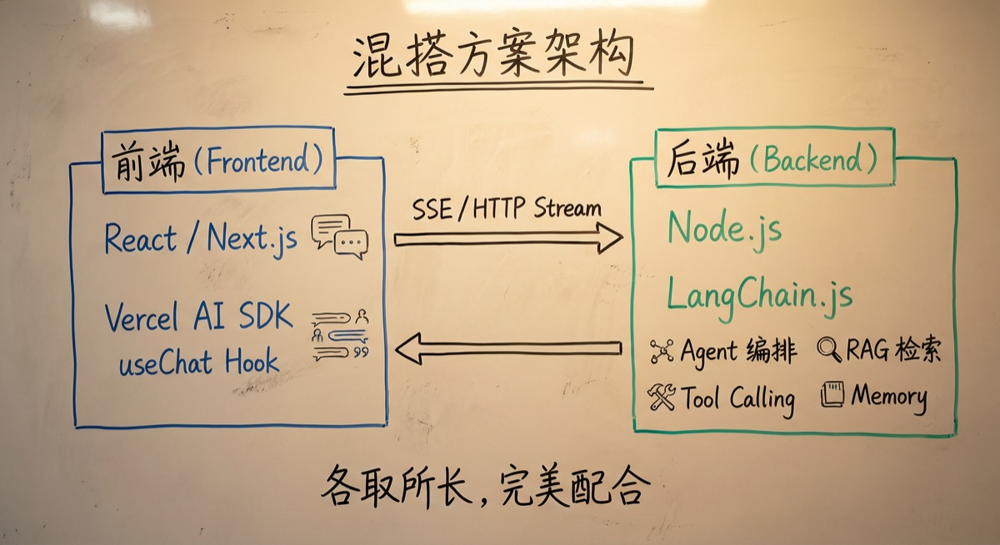
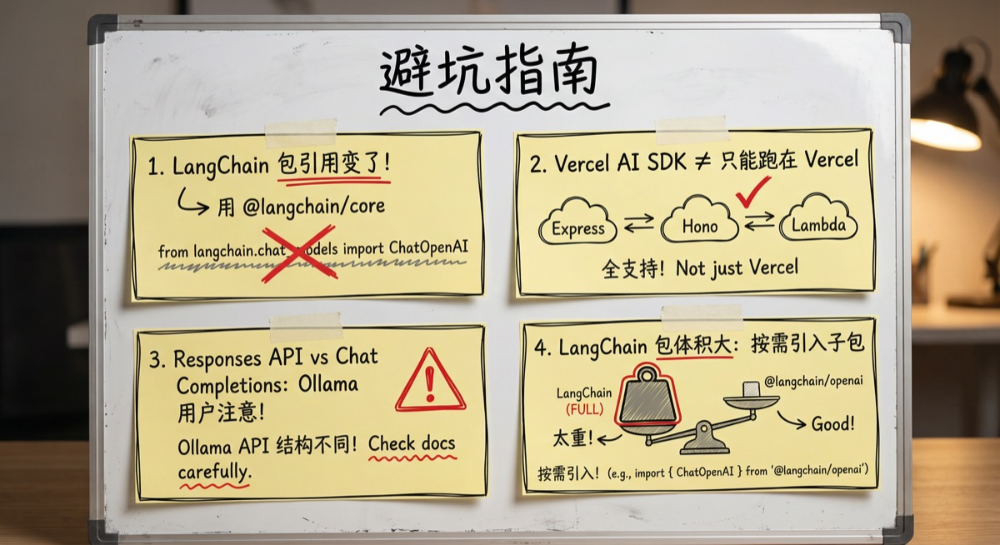

# 前端 AI SDK 怎么选？三大方案实战对比

想在前端项目里接入 AI 能力，你一定绕不过这三个名字：**Vercel AI SDK**、**LangChain.js**、**OpenAI SDK**。

它们各自占据一个生态位——有的专注流式渲染和 UI 集成，有的擅长 Agent 编排和 RAG 管线，有的就是官方出品、简单直接。选错了不至于做不出来，但大概率要在半路换工具，甚至重构核心逻辑。

今天这篇文章，我把三个 SDK 拉到一起，从**安装上手、流式对话、Tool Calling、框架集成、多模型切换**五个维度做一次实战对比，帮你在动手写代码之前就选对武器。

### 先说结论

如果你时间紧，直接看这张表：

| 维度                 | Vercel AI SDK    | LangChain.js       | OpenAI SDK   |
| ------------------ | ---------------- | ------------------ | ------------ |
| 定位                 | 前端 AI UI 框架      | LLM 应用编排框架         | OpenAI 官方客户端 |
| 流式渲染               | ⭐⭐⭐⭐⭐ 原生支持       | ⭐⭐⭐ 需要自己接          | ⭐⭐⭐ 原生支持     |
| React / Next.js 集成 | ⭐⭐⭐⭐⭐ 开箱即用       | ⭐⭐ 无官方 Hook        | ⭐⭐ 无官方 Hook  |
| 多模型支持              | 40+ Provider     | 13+ Provider       | 仅 OpenAI     |
| Tool Calling       | ⭐⭐⭐⭐⭐ Zod Schema | ⭐⭐⭐⭐ 灵活            | ⭐⭐⭐⭐ 原生支持    |
| Agent 编排           | ⭐⭐⭐⭐ SDK 5+ 内置   | ⭐⭐⭐⭐⭐ 核心能力         | ⭐⭐ 需自己做      |
| RAG 支持             | ⭐⭐ 需自行实现         | ⭐⭐⭐⭐⭐ 内置 Retriever | ⭐ 无          |
| 学习曲线               | 低                | 高                  | 最低           |
| 包体积                | 中                | 大                  | 小            |
| GitHub Star        | 22k+             | 14k+               | 8k+          |

**一句话总结**：

- **做 AI 聊天界面 / Next.js 项目** → Vercel AI SDK
- **做复杂 Agent / RAG / 多步编排** → LangChain.js
- **只调 OpenAI 一家、追求极简** → OpenAI SDK

---

### 三个 SDK 到底是什么

在具体对比之前，先搞清楚它们各自的"出身"和核心定位。

#### Vercel AI SDK

- **GitHub**：github.com/vercel/ai（22k+ Star）
- **npm 包**：`ai`（主包）+ `@ai-sdk/openai`、`@ai-sdk/anthropic` 等 Provider 包
- **当前版本**：5.x（2026 年初已发布 6.0 预览）

Vercel AI SDK 本质上是一个**前端 AI UI 工具箱**。它的核心卖点是两个东西：

1. **AI SDK Core**：`generateText`、`streamText`、`generateObject` 等函数，封装了与各家大模型的通信协议
2. **AI SDK UI**：`useChat`、`useCompletion`、`useAssistant` 等 React Hook，帮你用几行代码就搞定一个流式聊天界面

它不关心你的 Agent 怎么编排，也不管你的 RAG 管线怎么搭，它只关心一件事：**让前端和大模型的交互体验做到最好**。

#### LangChain.js

- **GitHub**：github.com/langchain-ai/langchainjs（14k+ Star）
- **npm 包**：`langchain` + `@langchain/core` + `@langchain/openai` 等
- **当前版本**：0.3.x

LangChain 最早是 Python 生态的 LLM 应用框架，后来出了 JS 版。它的核心定位是 **LLM 应用编排框架**——帮你把模型调用、Tool Calling、记忆管理、文档检索这些零件"串"成一条完整的处理链。

它的模块很多：Chain（处理链）、Agent（自主决策体）、Memory（对话记忆）、Retriever（检索器）、Tool（工具）……每个模块都是可插拔的，自由组合。

**优点是灵活性无敌，缺点是概念多、学习曲线陡**。

#### OpenAI SDK

- **GitHub**：github.com/openai/openai-node（8k+ Star）
- **npm 包**：`openai`
- **当前版本**：4.98.x

这个最简单——就是 OpenAI 官方出的 Node.js / TypeScript 客户端。它不是框架，不是工具箱，就是一个**调接口用的 SDK**。

2025 年底 OpenAI 推出了 Responses API 替代原来的 Chat Completions API，新 SDK 同步支持了这套新接口。功能上，它支持流式输出、Function Calling、文件上传、图片生成等 OpenAI 全量 API。

**最大限制**：只能调 OpenAI 的模型。你想换 Claude 或者 Gemini，这个 SDK 就帮不了你。

---

### 实战对比一：最简流式对话

做一个流式 AI 对话，三者的开发体验差距非常大。

**Vercel AI SDK** 的做法是：后端用 `streamText()` 一行发起流式请求，前端用 `useChat()` Hook 直接接——消息列表、输入状态、流式拼接、错误处理全部内置。两个文件、不到 30 行代码，一个完整的流式聊天界面就出来了。

**LangChain.js** 和 **OpenAI SDK** 的后端流式调用都不复杂（各自十来行），但它们都**没有前端 Hook**。你需要自己处理 `fetch` + `ReadableStream` + `TextDecoder`，自己管理 SSE 解析、消息拼接和状态更新——这些"胶水代码"加起来，轻松翻倍。

|  | Vercel AI SDK | LangChain.js | OpenAI SDK |
|---|---|---|---|
| 后端代码量 | 极少 | 中等 | 少 |
| 前端 Hook | `useChat` 开箱即用 | 无，自己写 | 无，自己写 |
| 流式协议 | 内置 Data Stream Protocol | 自己处理 SSE | 自己处理 SSE |

**如果你做的是带前端界面的 AI 应用**，Vercel AI SDK 在这个环节的优势是碾压级的。

---

### 实战对比二：Tool Calling

Tool Calling 是 AI 应用的标配能力——让 AI 自己决定什么时候调用外部工具。三者的核心差异在于**怎么定义工具参数**。

**Vercel AI SDK** 和 **LangChain.js** 都用 **Zod** 定义参数 Schema，类型安全、自带校验。区别在于 LangChain.js 的 Tool 定义后可以通过 `bindTools` 挂到任意 Agent/Chain 上复用，可组合性更强。

**OpenAI SDK** 用的是原生 JSON Schema——没有 Zod 那么爽，但不依赖任何额外库，直接照着 OpenAI 文档抄就能跑。需要注意的是，OpenAI SDK 拿到 Tool Call 结果后**需要你自己写分发逻辑**去匹配和执行对应函数，而另外两个 SDK 都能在定义时直接绑定执行逻辑。

| | Vercel AI SDK | LangChain.js | OpenAI SDK |
|---|---|---|---|
| Schema 定义 | Zod（类型安全） | Zod（类型安全） | JSON Schema（原生） |
| 执行逻辑 | 内置在 tool 定义中 | 内置在 tool 定义中 | 需要自己匹配和调用 |
| 可组合性 | 中 | 高（Agent/Chain 复用） | 低 |

---

### 实战对比三：框架集成

Vercel AI SDK 是**唯一一个为前端框架提供官方 Hook 的 AI SDK**——React、Svelte、Vue、Solid.js 全覆盖。一个 `useChat` 就帮你管了消息列表、输入状态、流式拼接、加载态、错误处理和重新生成，写起来就像"AI 版的 useForm"。

**LangChain.js** 是"后端优先"的框架，不提供任何前端 UI Hook。但好消息是它可以**和 Vercel AI SDK 混着用**——后端跑 LangChain.js 的 Agent 编排，前端用 `useChat` 做 UI，Vercel AI SDK 官方文档里有专门的集成指南。

**OpenAI SDK** 和前端框架没有任何集成，纯 HTTP 客户端，前端怎么渲染全靠你自己。

---

### 实战对比四：多模型支持

你的项目以后会不会需要切换或新增模型？这个问题决定了你今天选谁。

**Vercel AI SDK** 通过 Provider 插件机制支持 **40+** 模型厂商（OpenAI、Anthropic、Google、Azure、DeepSeek……）。每个厂商一个包，但对外 API 完全一致——你的业务代码**只需改一行 `model` 参数**就能切换模型，其余代码零改动。

**LangChain.js** 支持 **13+** Provider，所有模型实现了统一的 `BaseChatModel` 接口，换模型改构造函数即可，而且可以直接插到 Chain 和 Agent 里用，不需要改任何编排逻辑。

**OpenAI SDK** 只对接 OpenAI 自己的 API。想加 Claude 或 Gemini？要么再装一个对应厂商的 SDK，要么换 Vercel AI SDK / LangChain.js。

---

### 实战对比五：Agent 编排能力

当你的 AI 应用需要"自己决定调哪些工具、按什么顺序处理"，三者的差距就拉开了。

**Vercel AI SDK**（5.0+）通过 `maxSteps` 参数支持多轮自动 Tool Calling——AI 会循环"思考→调用工具→观察结果"直到完成任务。对简单到中等复杂度的 Agent 场景完全够用，但做不了多 Agent 协作、条件分支、状态图这类复杂编排。

**LangChain.js** 是这个环节的**绝对主场**。配合 **LangGraph.js**，你可以做到：

- **State Graph** —— 用图结构定义 Agent 决策流程
- **Supervisor 模式** —— 一个"管理者" Agent 协调多个"专家" Agent
- **Memory** —— 短期记忆（对话上下文）和长期记忆（跨会话）
- **Human-in-the-Loop** —— 在关键步骤让人类审核后再继续

如果你的产品需要做"AI 自动处理工单"、"AI 辅助数据分析"这类复杂场景，LangChain.js + LangGraph.js 是目前 JS 生态的最优解。

**OpenAI SDK** 本身不提供 Agent 编排能力。OpenAI 推出了 Agents SDK（`@openai/agents`），但生态远不如 LangChain。

---

### 选型决策树

说了这么多，到底该选哪个？我画了一个决策流程图：

整理成文字就是：

**场景一：做 AI 聊天界面 / AI 产品前端**

→ **Vercel AI SDK**。`useChat` 一把梭，流式渲染、状态管理、多模型切换全搞定。

**场景二：复杂 Agent 编排 / RAG 知识库 / 多 Agent 协作**

→ **LangChain.js**（后端）+ **Vercel AI SDK**（前端）。用 LangChain.js 的 Agent 和 Retriever 做后端逻辑，用 Vercel AI SDK 的 Hook 做前端展示。

**场景三：只调 OpenAI 的模型，功能简单，追求最小依赖**

→ **OpenAI SDK**。最轻量、最直接、没有任何多余抽象。

**场景四：不确定以后会不会换模型**

→ **Vercel AI SDK** 或 **LangChain.js**。两者都有良好的多模型抽象，以后换模型成本很低。

**场景五：全栈项目，前后端都有复杂需求**

→ **LangChain.js + Vercel AI SDK** 混搭方案。这不是非此即彼的选择——两者可以完美配合。

---

### 三个 SDK 能混着用吗？

可以，而且很多项目就是这么干的。

最常见的搭配是：**后端用 LangChain.js，前端用 Vercel AI SDK**。后端搭建 Agent 编排管线，通过 SSE 返回流式结果；前端用 `useChat` Hook 接收并渲染。两者通过标准 HTTP 流协议对接，互不侵入。

甚至你也可以在后端同时用 OpenAI SDK 做简单的直连调用（生成摘要、翻译），同时用 LangChain.js 做复杂的 Agent 任务。**它们不是互斥的。**

---

### 避坑指南

几个我实际踩过的坑，提前告诉你：

**1. LangChain.js 的版本混乱**

LangChain.js 的包拆分经历过好几次调整。现在的推荐做法是用 `@langchain/core` + 具体 Provider 包（如 `@langchain/openai`），尽量少直接依赖主包 `langchain`。如果你在网上看到的教程用的是 `import { ChatOpenAI } from 'langchain/chat_models/openai'` 这种写法，那已经过时了。

**2. Vercel AI SDK 不一定要部署在 Vercel**

虽然名字带 Vercel，但这个 SDK 完全可以跑在任何 Node.js 环境上——Express、Fastify、Hono、AWS Lambda 都行。不要因为名字就把它和 Vercel 平台绑定。

**3. OpenAI SDK 的 Responses API vs Chat Completions API**

OpenAI 2025 年底推出了 Responses API 作为新的推荐接口，但 Chat Completions API 仍然可用。如果你的项目需要兼容其他 OpenAI 兼容接口（比如本地部署的 Ollama），建议继续用 Chat Completions API，因为大部分兼容层还没适配 Responses API。

**4. 包体积要注意**

LangChain.js 的完整安装体积不小（加上各种依赖可以到几十 MB）。如果你只需要其中一小部分功能，考虑只装具体的子包而不是整个 `langchain`。Vercel AI SDK 和 OpenAI SDK 相对轻量。

---

### 总结

三个 SDK 各有所长，没有"绝对最好"的选择，只有"最适合你场景"的选择。

| 你的场景              | 推荐方案                                |
| ----------------- | ----------------------------------- |
| 快速做一个 AI 聊天产品     | Vercel AI SDK                       |
| 复杂 Agent + RAG 管线 | LangChain.js（后端）+ Vercel AI SDK（前端） |
| 只用 OpenAI、够简单就好   | OpenAI SDK                          |
| 不确定未来需求           | 先用 Vercel AI SDK，需要时加 LangChain.js  |

最后一个建议：**不要过早引入 LangChain.js**。如果你的需求就是一个简单的聊天界面 + 基本的 Tool Calling，Vercel AI SDK 一个就够了。等真正需要复杂 Agent 编排、RAG 检索、多 Agent 协作的时候，再把 LangChain.js 引进来做后端——这样你的架构是"渐进增强"的，不会一开始就背上不必要的复杂度。

**选对武器，事半功倍。**

推荐资源：

- **Vercel AI SDK 文档**：[https://sdk.vercel.ai](https://sdk.vercel.ai)
- **LangChain.js 文档**：[https://js.langchain.com](https://js.langchain.com)
- **OpenAI SDK GitHub**：[https://github.com/openai/openai-node](https://github.com/openai/openai-node)
- **LangGraph.js 文档**：[https://langchain-ai.github.io/langgraphjs/](https://langchain-ai.github.io/langgraphjs/)

### 最后

欢迎扫码加我微信，拉你进技术群，长期交流学习...

欢迎关注「前端Q」,认真学前端，做个有专业的技术人...

