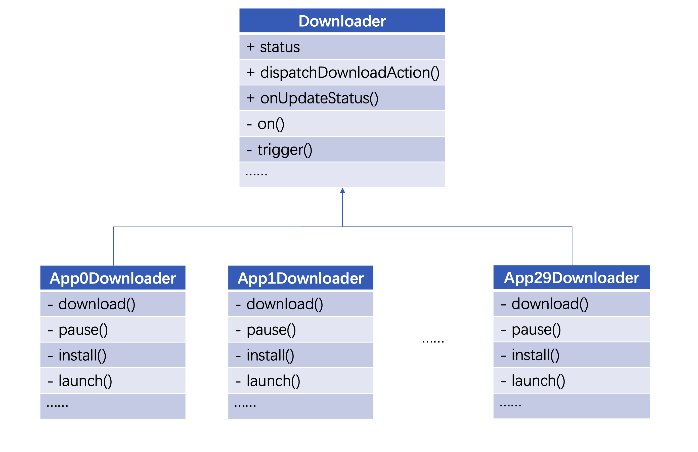
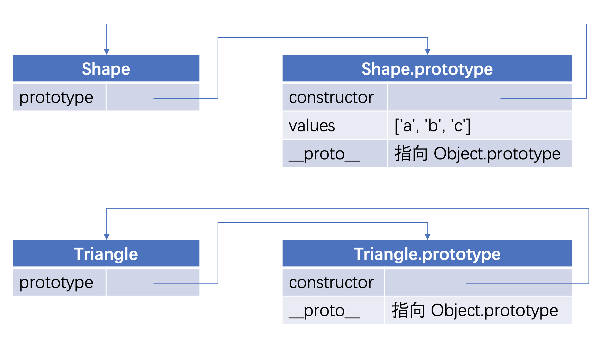
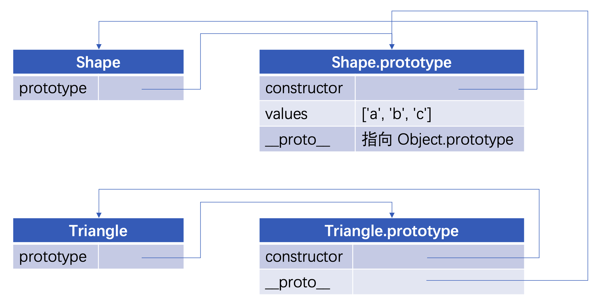
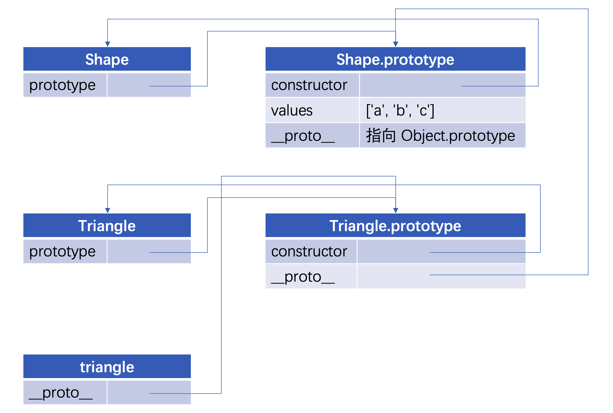

为什么要用继承?

平时写代码时, 似乎不用继承也可以比较好地完成需求, 但如果你在一些恰当的场景使用继承, 可以大幅地简化代码, 提高代码复用率, 使得代码在后期更易于维护. 举个例子(这个例子有点长, 但还是比较有趣的):

## 继承的实际使用示例

笔者在某个厂工作, 这个厂有很多 App, 而且这些 App 属于各个部门, 他们之间各自为政, 没有通用的 js sdk, 而是每个 App 都有一份自己的 js sdk. (没有通用 js sdk 本来是不合理的, 但现状如此). 这里有个需求: 在所有 App 内嵌 webview 里打开的网页实现页内下载. 简言之, 需要实现一个 js 下载器, 他弥合了所有 App 的 js sdk 的差异. 对调用者来说, 只需要这么做:

```js
import Downloader from 'Downloader';

const downloader = new Downloader(options);

downloader.onStatusUpdate((status) => {
    // 在 UI 上设置状态
    this.setState({
        buttonText: status.message,
        buttonProgress: status.progress,
    })
})

button.addEventListener('click', () => {
    downloader.dispatchDownloadAction();
});
```

如上, 我们要实现一个 `Downloader`, 他监听了状态变更, 在我们点击按钮时, 需要触发下载, 暂停, 安装, 打开等动作, 我们只需要调用以下语句

```js
downloader.dispatchDownloadAction();
```

即可触发当前状态下的正确行为, 比如在初始状态, 会触发下载, 并且在 `onStatusUpdate` 的回调中, 传递当前状态的文案, 比如 `已下载 10%`, 和当前的进度数值, 如 `0.1`, 方便调用方设置进度条.

如果正在下载中, 调用 `downloader.dispatchDownloadAction()`, 则会暂停, 并且返回适当的 `status`, 同理, 再调用一次该函数, 则继续下载, 下载完成, 再次调用, 则进行安装... 直到打开.

这里再次强调, 有很多 App, 比如说有 30 个, 30 个 App 都提供不一样的 js sdk, 那么要在 Downloader 中实现 30 份下载器, 这里边就有很多可复用的逻辑了.

比如处理状态的逻辑: 在初始, 下载, 暂停, 安装, 打开这些状态下, `dispatchDownloadAction` 应该有哪些动作, 这是可以复用的, 另外, 下载器的单例, 是否自动下载, 事件模型的实现, 都可以复用.

此时, 继承是一个很好的实践, 甚至是最佳实践. 我们来看看在这个场景下的类图:



我们实现一个父类 `Downloader`, 他有一个 `status` 属性, 还有两个公有方法 `dispatchDownloadAction` 和 `onUpdateStatus`, 有两个私有方法 `on` 和 `trigger`, `on` 可以监听自定义事件, `trigger` 可以触发事件, 用于给子类调用, 比如子类在下载时, 可以 `trigger` 进度条的变化信息.

我们要实现 30 个子类, 他们分别都实现了各自的下载, 暂停, 安装, 打开方法, 这些方法里的逻辑都是不能复用的, 就是一些和各个 app 的 js sdk 打交道的逻辑. 而这些方法中, 有的可以调用父类的 `trigger` 方法更新状态, 有的可以被父类通过 `this.xxx` 调用.

而父类的 `dispatchDownloadAction` 具有统筹帷幄的作用, 大致伪代码如下:

```js
dispatchDownloadAction: () => {
    switch(status) {
        case 默认状态: {
            this.download() // 调用的是子类实现的方法
            break;
        }
        case 下载中: {
            this.pause() // 调用的是子类实现的方法
            break;
        }
        case 暂停中: {
            this.download() // 调用的是子类实现的方法 
            break;
        }
        case 下载完成: {
            this.install() // 调用的是子类实现的方法
            break;
        }
        case 已安装: {
            this.launch() // 调用的是子类实现的方法
            break;
        }
    }
}
```

这就是我们用继承的方式, 将可复用的方法抽象到父类中, 而子类只实现各自不可复用的部分.

除了这个例子, 这里再简单举一个, 我们写 react component 的时候, 如下语句就使用了继承:

```js
class MyComponent extends React.Component;
```

该语句使得组件的各个生命周期函数可被调用, 如 `render`, `componentDidMount`, `componentDidUpdate`, 也让我们能访问到父类 `Component` 的属性和方法, 如 `this.props` 和 `this.setState()`

可见, 继承在我们身边发挥着重要的作用. `继承` 是面向对象的三个基本特征之一, 掌握好了, 可以让我们设计出更好维护的代码.

接下来我们讲一下在 js 中如何实现继承

## 如何实现继承

在 ES6 中, 实现继承很简单, 使用 `extends` 即可完成, 如下:

```js
class subType extends superType;
```

以上写法在一些低版本的浏览器中无法支持, 通常我们的打包工具会把 `extends` 编译成 es5 的实现.

本篇的主旨, 就是讲 es5 原型继承的实现. 为什么 2020 年了, 还要了解 es5 的原型继承呢? 原因如下:

1. 一些库的源码, 可能基于 es5 编写, 涉及到原型继承, 不懂原理会看不懂
2. 作为 js 的基础, 还是有必要了解的, 基础扎实, 对编码有帮助
3. 一些面试经常会问原型继承的内容

在 es5 中, 继承基于原型链实现, 原型链的内容在该系列的上一篇 [图解 JavaScript 原型与原型链](https://mp.weixin.qq.com/s/St78Y38j3XI2_Zv57bNZ0Q) 有讲解, 本篇就不会再讲原型链的基础内容了. 有不了觉原型链的, 建议从该系列的上一篇开始看. 本篇讲解几个常用的继承实现方法.

## 关于原型继承的理解

原型继承基于原型链, 我们可以顺着原型链一直往上找, 找到想要的属性和方法. 但在这个过程中, 需要解决一些问题, 比如怎么防止原型里的属性继承后, 被共享, 怎么给父类传参, 怎么减少性能浪费, 如减少存储空间和函数执行次数等.

我们来看一下最基本的继承实现:

```js
// 形状
function Shape() {
    this.values = ['a', 'b', 'c'];
}

// 三角形
function  Triangle() {}
```

此时的原型关系如下:



如图, 此时形状与三角形还没有继承关系, 以下语句将让他们产生继承关系

```js
Triangle.prototype = new Shape();
```

此时的原型关系如下:



可以看到, 此时 `Triangle.prototype.__proto__` 已经不再指向 `Object.prototype`, 而是指向 `Shape.prototype`.

我们来看一下此时 `new` 一个 `Triangle` 的实例是个什么情况:

```js
const triangle = new Triangle();
```



可以看到, `triangle` 这个实例, 可以循着原型链找到 `values`

即:

```js
console.log(triangle.values); // ['a', 'b', 'c']
```

但这里存在个问题, 就是 `values` 是被所有实例共享的, 比如:

```js
const triangle1 = new Triangle();
triangle1.values.push('d');
console.log(triangle1.values); // ['a', 'b', 'c', 'd'];

const triangle2 = new Triangle();
console.log(triangle2.values); // ['a', 'b', 'c', 'd'];
```

这种共享的属性, 会互相影响, 上边这个继承还不合格, 我们来看一个进阶版的继承实现

## 组合式继承

组合式继承这个名词来源于 JavaScript 高级程序设计, 这里不深究, 怎么叫只是个名字, 我们要了解的是它的原理

```js
function Shape(name) {
    this.name = name;
    this.values = ['a', 'b', 'c'];
}

Shape.prototype.getName = function() {
    return this.name;
}

function Triangle(name) {
    // 以下语句借用了 Shape 的构造函数, Shape 构造函数在执行时, this 是子类的实例
    // 而且这么一借用, 我们就可以给父类的构造函数传递参数了~
    Shape.call(this, name);
    // call 是每个函数都有的一个方法, 他可以执行该函数, 并且改变函数内部 this 的指向, 且给函数传递参数
}

Triangle.prototype = new Shape();

const triangle1 = new Triangle('等腰三角形');
triangle1.values.push('d');
console.log(triangle1.values); // ['a', 'b', 'c', 'd']

const triangle2 = new Triangle('全等三角形');
console.log(triangle2.values); // ['a', 'b', 'c'] // 看, 属性没有互相影响

console.log(triangle1.getName()) // 等腰三角形
console.log(triangle2.getName()) // 全等三角形
```

组合式继承是一个合格的继承实现, 他解决了属性共享的问题, 也解决了向父类构造函数传递参数的问题. 但其实还有一些缺陷, 细心的同学应该发现了, 父类构造函数被执行了两次, 一次是 `call` 执行, 一次是 `new` 执行, 并且 `values` 不仅存在于 `triangle` 实例中, 也存在于 `triangle.__proto__` 中, 这造成了性能浪费. 

本篇不打算细讲如何一步步地将继承实现到完美, 旨在让大家了解继承的应用与基于原型的实现, 想要充分掌握的, 建议看书了解, 推荐《JavaScript 高级程序设计》, 这本书被称为前端基础知识的红宝书, 这里给刚接触 js 的同学强烈安利一波~


## 小结

继承给我们提供了一种优雅可复用的编码方式, 在一些大型应用或框架中是经常用到的, 本篇介绍了基于继承的两个应用, 阐述了 ES6, ES5 的继承实现, 继承的知识在面试中也经常被问到, 快掌握起来吧~

## 参考资料

> JavaScript 高级程序设计
