# 手把手教你 Serverless 实战

### 前言

Serverless = Faas (Function as a service) + Baas (Backend as a service)

Serverless 让我们更专注于业务开发, 一些常见的服务端问题, Serverless 都帮我们解决了: 

* Serverless 不需要搭建服务端环境, 下发环境变量, 保持各个机器环境一致 (Serverless 的机制天然可复制)
* Serverless 不需要预估流量, 关心资源利用率, 备份容灾, 扩容机器 (Serverless 可以根据流量动态扩容, 按真实请求计费)
* Serverless 不需要关心内存泄露, (Serverless 的云函数服务完后即销毁)
* Serverless 有完善的配套服务, 如云数据库, 云存储, 云消息队列, 云音视频和云 AI 服务等, 利用好这些云服务, 可以极大得减少我们的工作量

以上前三点是 Faas 的范畴, 第四点是 Baas 的范畴. 简单来讲, Serverless 可以理解为有个系统, 可以上传或在线编辑一个函数, 这个函数的运行环境由系统提供, 来一个请求, 系统就自动启动一个函数进行服务, 我们只需要写函数的代码, 提交后, 系统根据流量自动扩缩容, 而函数里可以调用各种现有的云服务 api 来简化我们的开发与维护成本.

看了很多关于 Serverless 的文章, 大部分都在讲架构, 讲 serverless 本身的实现. 本篇就以简单明了的例子阐述一个简易博客系统在腾讯云 Serverless 中的落地, 期间只会涉及 Faas 和 Baas 的实践部分.

让我们开始吧~

### 简易博客系统功能概要

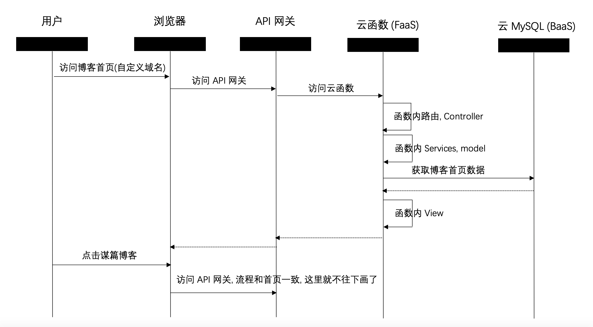

如上时序图所示, 本次实现的简易博客系统, 只有博客列表页和博客内容页, 不涉及评论, 登录, 侧重于 Serverless 落地相关的内容, 如云函数本身怎么编写, 怎么在本地开发, 怎么跟自定义域名关联, 怎么访问云 MySQL, 云函数内的代码, 如 Router, Controller, Service, Model 和 View 等怎么组织.

带着这些疑问, 让我们开始吧~

### 云函数的初始化与基础配置

访问 [https://cloud.tencent.com/product/scf](https://cloud.tencent.com/product/scf), 点击立即使用进入云函数:

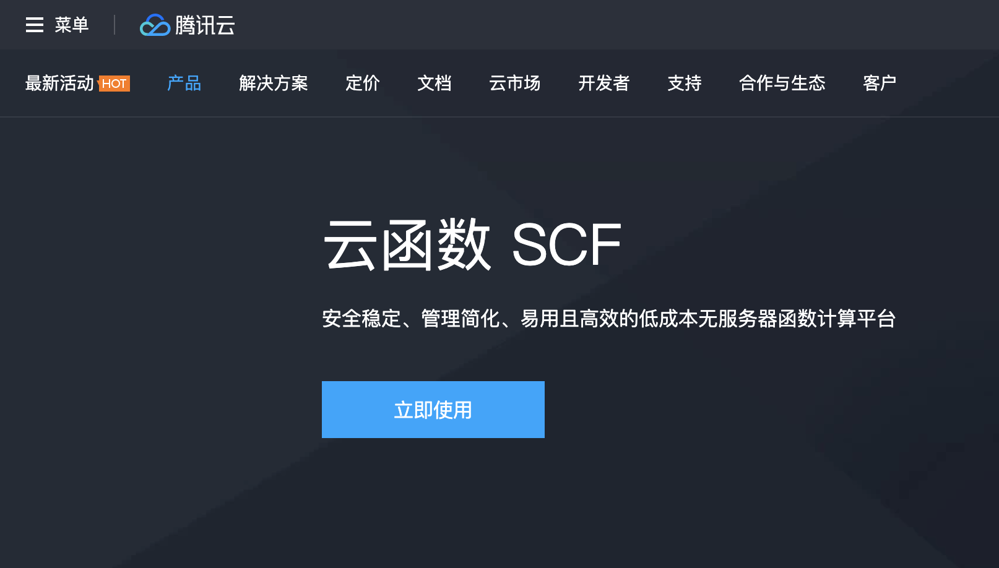

为了让你不感到畏惧, 先交个底, 腾讯云函数每月有 100 万次调用的免费额度, 个人学习使用完全够了.

好的, 我们继续~

在点击上图的 "立即使用" 后, 我们可以看到云函数的概览界面:

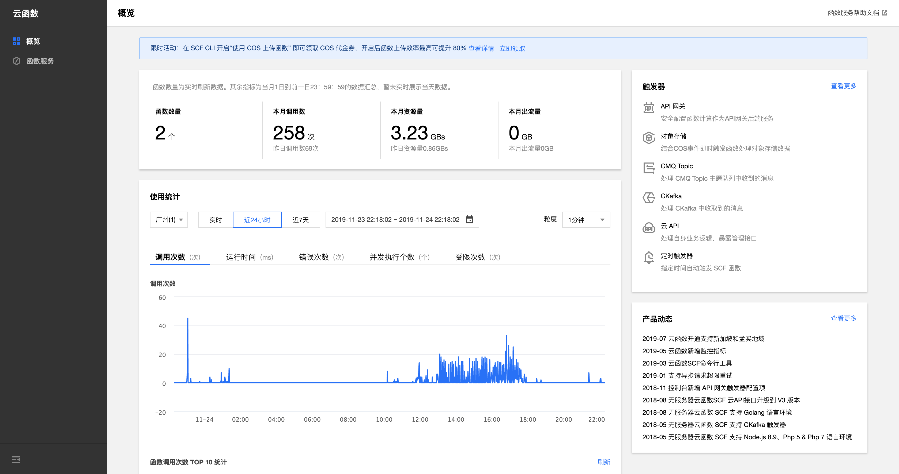

点击左侧的函数服务, 在出现的界面中, 点击新建:

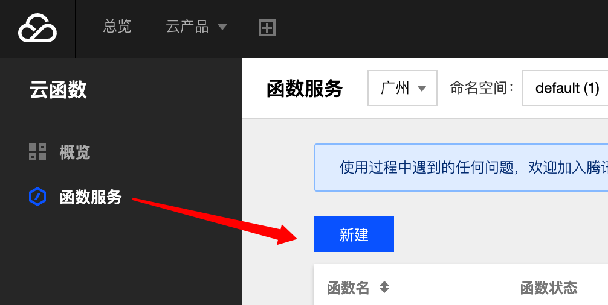

出现了下方截图的这个页面, 输入函数名, 选择语言, 可以从函数模板中选择一个初始化, 这里选了右下角这个 "国庆 SCF 运营推广活动 Demo". ps, 注意这里有很多模板, 比如访问数据库, 返回页面, 图像压缩, 视频转码, 文件合并等等, 降低了我们的入门成本.

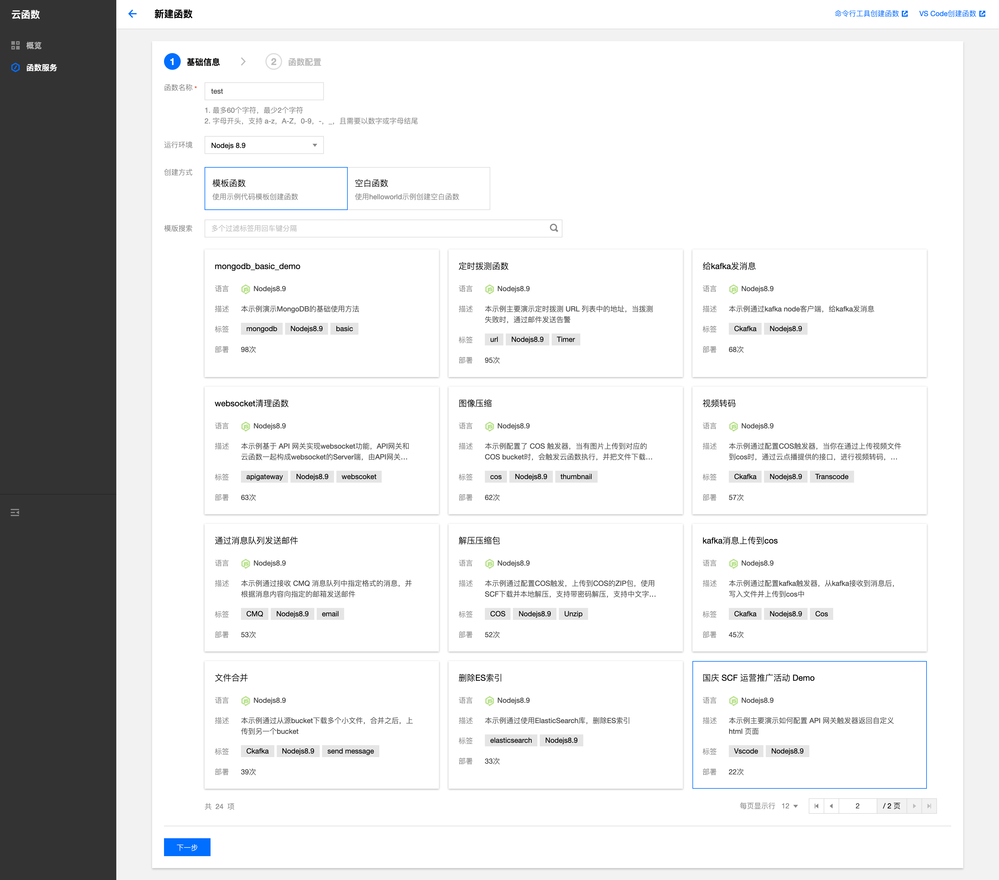

选择好模板后, 点击下一步, 出现的这个界面, 设置环境变量和网络环境

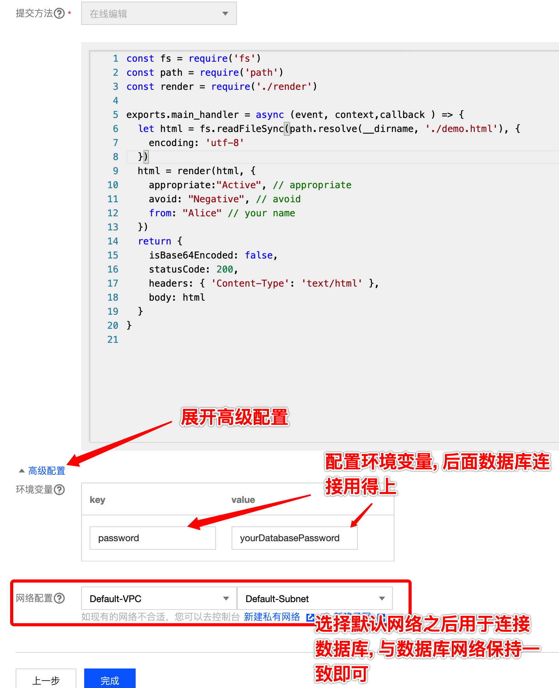

点击完成, 我们的云函数就生成啦, 来看一下效果, 虽然是云函数, 但这里不止一个文件哦, 是可以以多个文件的形式组织起来的:

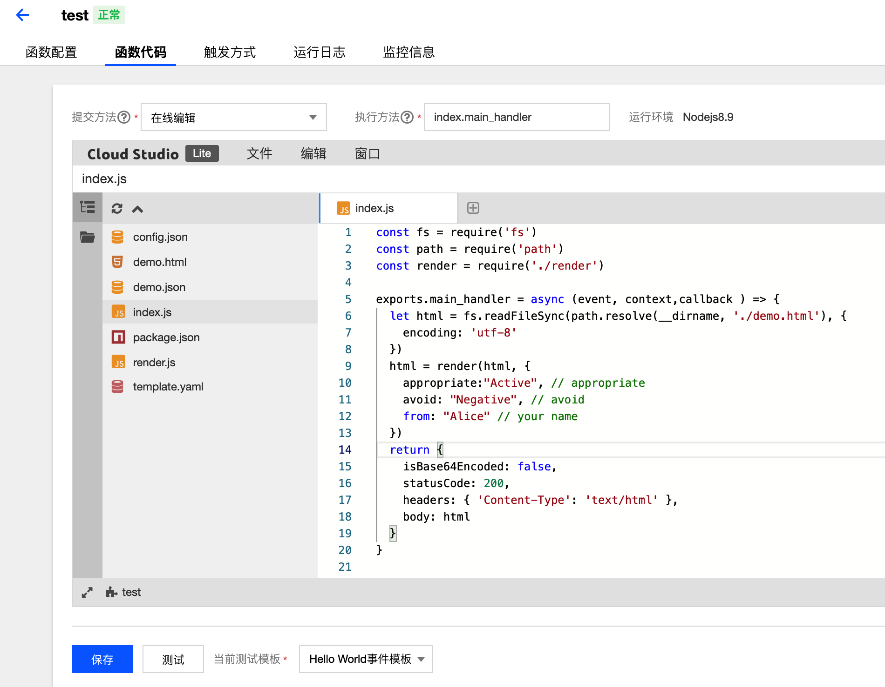

细看代码, 做的事情很简单, 根据云函数标准, 暴露了一个 main_handler, 里边读取了一个 html 页面模板, 通过 render 函数将 html 模板 + 数据解析为 html 字符串, 最后返回.

那我们要怎么才能访问到这个云函数呢?

答案就是配置触发方式了, 我们将触发方式配置成 API 网关触发, 设置如下:

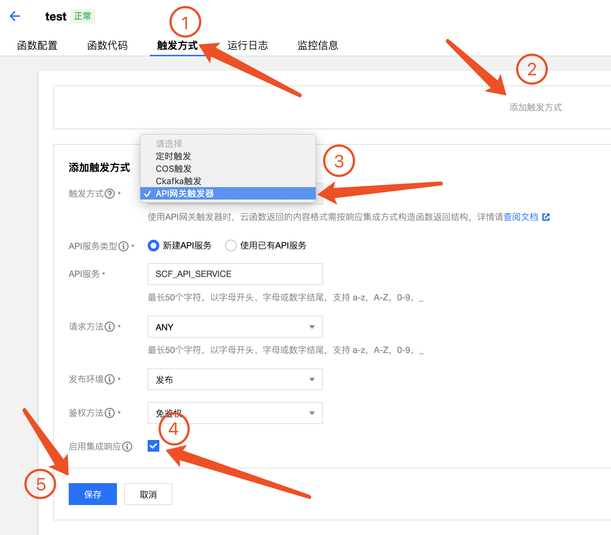

这里解释一些图中的概念：
+ 定时触发：通常用于一些定时任务, 如定时发邮件, 跑数据, 发提醒等.
+ COS 是腾讯云存储, 比如图片, 视频就可以用 COS 存储, COS 触发是指文件上传到 COS 后, 会触发这个函数, 此时这个函数可以用来压缩图片, 做视频转码等等.
+ Ckafka 触发, 当 Ckafka 消息队列有新数据时触发. 
+ API 网关触发, 就是有请求过来时, 才触发这个函数.

这里我们选择 API 网关触发, 也就是有请求过来时, 才触发这个函数.

保存后, 我们就能看到云函数的访问路径了:

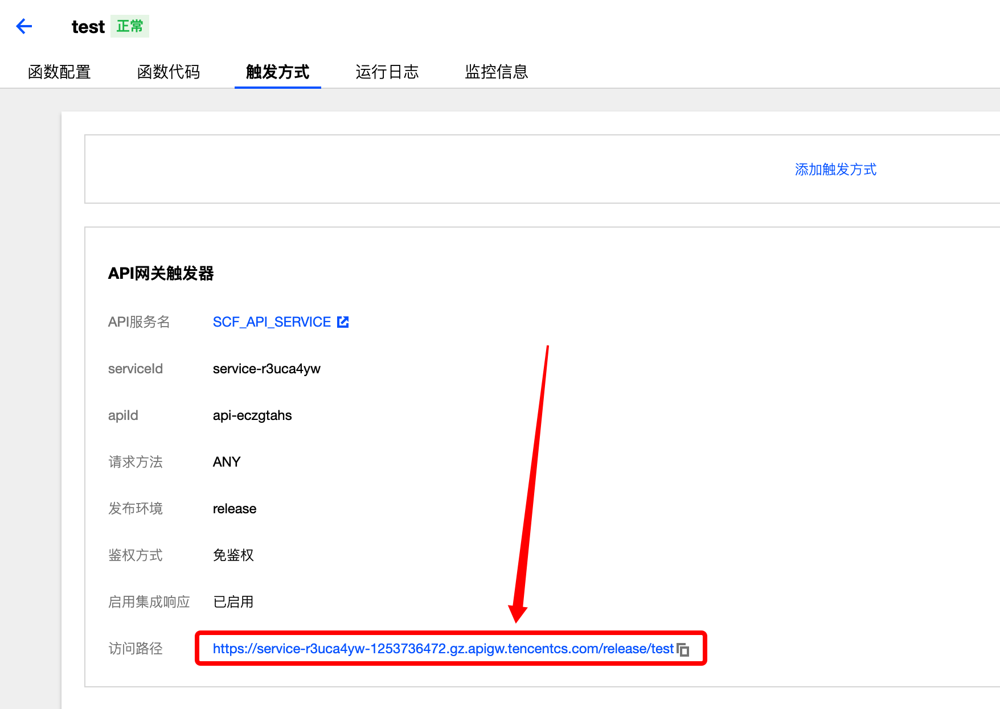

这里贴一下我例子中的访问链接, 大家可以体验一下~

[https://service-r3uca4yw-1253736472.gz.apigw.tencentcs.com/release/test](./https://service-r3uca4yw-1253736472.gz.apigw.tencentcs.com/release/test)

如果你改完代码想发布, 只需要点一下保存, 就可以发布了~

以上就是我们对云函数的初步认识, 接下来我们一步步深入, 带你打造一个简易博客系统

### Tencent Serverless Toolkit for VS Code

首先, 我们需要一个本地开发环境, 虽然线上编辑器的体验与 vscode 已经比较相近了, 但毕竟本地代码编辑经过我们配置, 还是更好用的. 那我们在本地修改了代码, 怎么发布云函数呢?

以 VSCode 为例, 我们需要安装 "Tencent Serverless Toolkit for VS Code", 我们可以在 VSCode 的插件里搜索安装, 插件首页的安装说明很清楚的.如图：

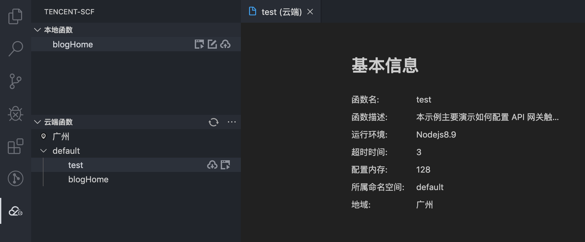

安装完后, 左侧会多一个云函数的图标. 通过这个插件, 你可以:

* 拉取云端的云函数列表，并触发云函数在云端运行。
* 在本地快速创建云函数项目。
* 在本地开发、调试及测试您的云函数代码。
* 使用模拟的 COS、CMQ、CKafka、API 网关等触发器事件来触发函数运行。
* 上传函数代码到云端，更新函数配置。

通常前端的代码, 需要打包, 执行 `npm install`, `npm run build` 等, 云端函数没有提供这个环境, 我们可以在本地打包后, 通过这个插件发布代码. 当然, 我们还可以通过持续集成工具, 运行 cli 来发布, 这个暂时就不展开说了.

### 数据库选择和设计

#### 数据库选择

这里选择的是[腾讯云 MySQL](https://cloud.tencent.com/product/cdb) 基础版最低配, 一个月才 29 元~. 当然, 自己搭建数据库对外暴露用于学习也是可以的. 不过如果后期要长期使用, 为了方便维护和确保数据稳定, 建议选择`云 MySQL`. 云 MySQL 不需要我们关心安装和数据因机器挂了而丢失的问题. 开箱即用也是 Baas 的特点.

注意到里边选择的网络是 Default-VPC, Default-Subnet, 需要保持跟云函数一致, 不然云函数访问不到 MySQL,如图：

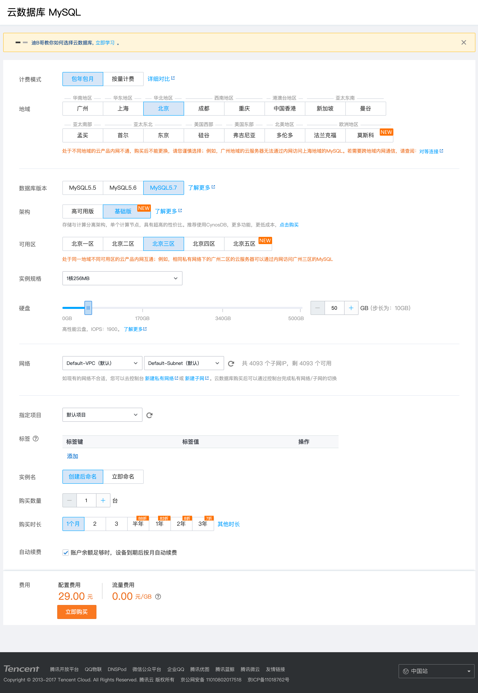

激活云 MySQL 后, 这里可以看到内网 ip 和端口, 云函数可以通过这个 ip 和端口访问到 MySQL:

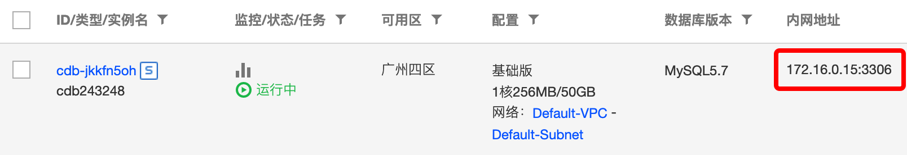

### 数据库设计

因为是一个简易的博客系统, 不涉及登录和评论, 在满足数据库设计第三范式的基础上, 我们只需要设计一张表即可, 即博客表本身:

| 字段名 | 字段类型
| :---: | :---: |
| id    | 主键   |
| title | 标题   |
| content | 文章内容 |
| createdAt | 创建时间 |
| updatedAt | 修改时间 |

因为我们后边会使用 MySQL 的 Node.js ORM 框架 Sequelize 来操作数据库, 数据库表的创建是自动完成的, 这里我们就不再说明啦~

后边会有 Sequelize, 还有怎么连接, 操作数据库的介绍~

### 云函数自定义域名与 API 网关映射

#### 域名解析

前面说到, 云函数创建完配置好 API 网关触发器后, 就可以在外网访问了, 但是默认的 url 完全无法记忆, 不利于传播, 我们需要一个自定义域名. 关于域名如何购买这里就不展开了, 大家可以参照这篇[官方文档](https://cloud.tencent.com/document/product/242/9595)进行购买, 便宜的才 5 块钱一年 ~

这里给大家介绍, 怎么给云函数绑定自定义域名:

在购买域名后, 我们需要在[域名解析列表](https://console.cloud.tencent.com/cns)里添加域名解析:

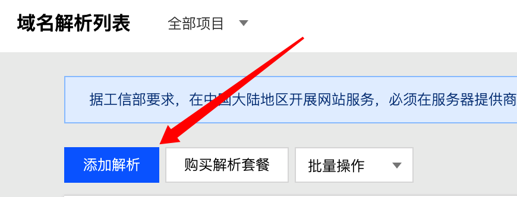

如下图, 将 @ 和 www CNAME 到我们的云函数域名, 相当于是给云函数的域名起了个别名, 访问自定义域名, 就可以访问到云函数域名经过解析后的 ip: 

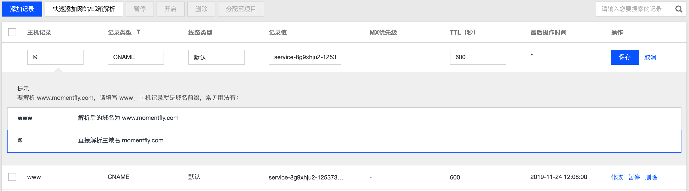

> 注意, 记录值只需要填写云函数的域名即可, 不需要填路径, 也不需要填协议

#### API 网关映射

光是将自定义域名解析到云函数域名是不够的, 我们还要映射路径, 我们打开 [API 网关的服务](https://console.cloud.tencent.com/apigateway/service?rid=1), 点击我们的云函数服务名, 打开自定义域名, 点击新建:

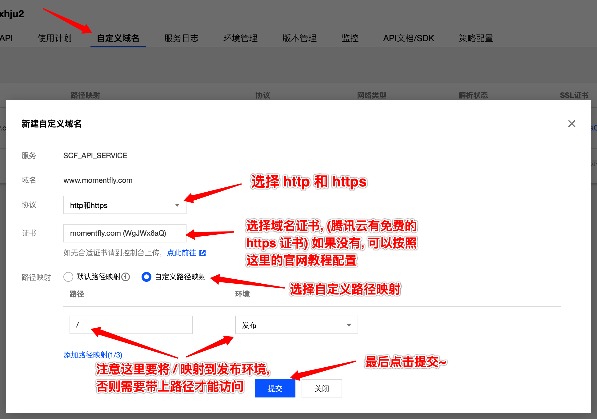

按照截图中操作后, 我们就可以在外网以自己的域名访问到云函数啦~

这里放上本篇文章最终实现的简易博客地址: [https://www.momentfly.com/](https://www.momentfly.com/)

#### 云函数中的路由设计

正如我们前面提到的, 实现的简易博客系统有两个页面, 可以通过两个云函数来对应两个页面, 但这种实现不优雅, 因为代码复用不了, 比如我们写的一些处理页面的公共方法, 就得在两个函数里都实现一遍. 而且 node_modules 在两个云函数里都得存在, 浪费空间. 

所以我们得在一个函数里, 将两个页面的代码组织起来, 最容易想到的是写一个简单的判断, if 路径为 /, 则返回博客列表页, else if 路径为 /post, 则返回博客内容页. 但这还是不优雅, 要获取路径, 再写一堆 if else 来做路由, 不是很好维护, 而且如果要扩展, 还得增加 get, post 等请求的判断, 再加上路径上的参数也要手工写函数来获取.

能不能像 Express 或 koa 一样方便地组织代码呢? 答案是肯定的!

如果对比过 AWS Lambda (亚马逊云 云函数), 会发现腾讯云函数和 AWS Lambda 在入口参数上是一致的, 我们可以通过 [serverless-http](https://github.com/dougmoscrop/serverless-http) 这个库, 实现 koa 的接入. 这个库原本是为 AWS lambda 打造的, 但可以无缝地在腾讯云函数上使用.

如上面提到的, 云函数的入口代码 main_handler 如下:

```javascript
exports.main_handler = async (event, context, callback) => {

}
```

我们将代码拉到本地, 安装 koa, koa-router, serverless-http 后, 按照如下方式组织, 即可将 koa 无缝接入:

```javascript
const Koa = require("koa");
const serverless = require("serverless-http");
const app = new Koa();
const router = require('./router');

app
  .use(router.routes())
  .use(router.allowedMethods())

const handler = serverless(app);
exports.main_handler = async (event, context, callback) => {
  return await handler(
    { ...event, queryStringParameters: event.queryString },
    context
  );
}
```

而我们的 router 文件, 就是 koa 常规的写法了:

```javascript
const Router = require('koa-router');
const { homeController } = require('../controllers/home')
const { postController } = require('../controllers/post')

const router = new Router();

router
    .get('/', homeController)
    .get('/post', postController)

module.exports = router;
```

看到这里, 熟悉 koa 的同学已经掌握了该篇的主旨, 明白了 Serverless 落地的一种方式. 但接下来还是会完整地将这个简易博客系统搭建相关的逻辑讲清楚, 感兴趣的同学继续往下看吧~ 

### 云函数中的代码组织

和普通 koa 应用的组织方式一致, 为了职责分明, 通常会将代码组织为 Router, Controller, Service, Model, View 等. 在通过 `serverless-http` 将 koa 接入进来后, 我们的云函数服务组织方式就完全跟传统 koa 应用一致了, 我们来看看项目的完整目录:

```
/blog
├── controllers
|  ├── home
|  |  └── index.js
|  └── post
|     └── index.js
├── index.js
├── model
|  ├── db.js
|  └── index.js
├── package.json
├── router
|  └── index.js
├── services
|  ├── assets
|  |  └── index.js
|  ├── data
|  |  └── index.js
|  ├── home
|  |  └── render.js
|  ├── post
|  |  └── render.js
|  └── response
|     └── index.js
├── template.yaml
├── view
|  ├── github-markdown.css
|  ├── home
|  |  ├── home.css
|  |  └── home.html
|  └── post
|     ├── post.css
|     └── post.html
└── yarn.lock
```


#### Controller

Controller 可以很清晰地反应一个请求的处理过程, 一些实现细节应该封装起来, 放在 Service 中, 这点在流程复杂的项目中特别重要. 

我们两个页面的 Controller 就很简单:

controllers/home/index.js - 博客列表页
```javascript
const render = require('../../services/home/render');
const { getBlogList } = require('../../services/data')
const { htmlResponse } = require('../../services/response')

exports.homeController = async (ctx) => {
    const blogList = await getBlogList() // 获取数据
    const html = render(blogList) // 数据 + 模板生成 html
    htmlResponse(ctx, html) // 返回 html 的流程
}
```

controllers/post/index.js - 博客内容页
```javascript
const render = require('../../services/post/render');
const { getBlogById } = require('../../services/data')
const { htmlResponse } = require('../../services/response')

exports.postController = async (ctx) => {
    const { id } = ctx.query 
    const blog = await getBlogById(id)
    const html = render(blog)
    htmlResponse(ctx, html)
}
```

可以看到, 我们的 Controller 都只有三个步骤, 即 

1. 获取数据
2. 数据 + 模板生成 html
3. 返回 html 的流程. 

我们会在接下来的 Services 里讲清楚这三个步骤的具体实现.

#### Services

本篇的简易博客系统, 博客列表页和内容页很相似, 所以代码也会比较相近, 这里就选择博客列表页来讲 Services 啦:

上边的 Controller 都是先获取数据的, 我们来看看 data 这个 services:


/services/data/index.js
```javascript
const { Blog } = require('../../model')

exports.getBlogList = async () => {
    await Blog.sync({}); // 如果表不存在, 则自动创建, sequelize 的一个特性
    return await Blog.findAll();
}

exports.getBlogById = async (blogId) => {
    await Blog.sync({}); // 如果表不存在, 则自动创建, sequelize 的一个特性
    return await Blog.findOne({
        where: {
            id: blogId,
        }
    })
}
```

通过定义好的 Model, 也就是 Blog, 执行 `await Blog.findAll()`, `await Blog.findOne` 即可获取到博客列表和博客首页.

数据获取完了, 按照上边 Controller 的流程, 我们就要执行数据与 html 模板的拼接了, 来看 render 的 service:

services/home/render.js
```javascript
const template = require('art-template');
const marked = require('marked');
const hljs = require('highlight.js');
const { markdownCss, hightlightCss, resolveAssetsFromView } = require('../assets');
const homeHtml = resolveAssetsFromView('./home/home.html');
const homeCss = resolveAssetsFromView('./home/home.css');

module.exports = (blogList) => {
    marked.setOptions({
        highlight: function (code, lang) {
            return hljs.highlight(lang, code).value;
        }
    });

    let html = template.render(homeHtml, {
        blogList: blogList.map((blog) => {
            blog.content = marked(blog.content);
            return blog;
        }),
        markdownCss,
        hightlightCss,
        homeCss,
    })

    return html
}
```

这里用了 [art-template](https://aui.github.io/art-template/zh-cn/), 是一个高性能模板引擎.

使用模板引擎来处理 html 模板和数据, 没有用 react, vue 的原因是简易博客系统太简单, 没必要使用框架. 况且这个简易博客系统的初衷侧重于 Serverless 的实践, 用 react, vue 或者简单的模板引擎, 对 Serverless 实践没有影响, 如果换成 react, vue 做 ssr, 则需要另外开一个话题阐述了.

+ `marked` 是将 markdown string 转成 html string 的一个库, 如将 `# hello` 转成 `<h1>hello</h1>`

+ `highlight.js` 用于高亮 markdown 中的代码

+ `markdownCss, hightlightCss, homeCss,` 是写好的 css 文件, 用 fs 读取出来的文件内容字符串 

关键的一句, 通过 art-template, 将 html 模板, 数据 (blogList, css) 渲染成 html
```javascript
let html = template.render(homeHtml /* 模板 */, { /* 模板变量 */
    // 数据
    blogList: blogList.map((blog) => {
        blog.content = marked(blog.content); // markdown 的处理
        return blog;
    }),
    // 对模板来说, 以下这些也是数据, 只不过数据内容是 css 字符串罢了
    markdownCss,
    hightlightCss,
    homeCss,
});
```

上面的 markdownCss, hightlightCss, homeCss 是通过 assets 处理出来的, 我们来看一下 assets 的处理:

/services/assets/index.js
```javascript
const fs = require('fs');
const path = require('path');

const hightlightCss = fs.readFileSync(path.resolve(__dirname, '../../node_modules/highlight.js/styles/atom-one-light.css'), {
    encoding: 'utf-8',
})
const markdownCss = fs.readFileSync(path.resolve(__dirname, '../../view/github-markdown.css'), {
    encoding: 'utf-8',
})

const resolveAssetsFromView = (relativePath) => {
    // 辅助函数, 方便从 view 将文件读取为字符串
    const filePath = path.resolve(__dirname, '../../view', relativePath);
    console.log(`filePath: ${filePath}`);
    return fs.readFileSync(filePath, {
        encoding: 'utf-8',
    })
}

module.exports = {
    hightlightCss,
    markdownCss,
    resolveAssetsFromView
}
```

通过 fs.readFileSync(), 按照 utf-8  的方式读取文件, 读取完后连同辅助函数一起暴露出去.

到了 Controller 的最后一步, 即返回 html, 我们通过 response service 来实现:

/services/response/index.js

```javascript
exports.htmlResponse = (ctx, html) => {
    ctx.set('Content-Type', 'text/html');
    ctx.body = html
    ctx.status = 200
}
```

#### Model

上边的 data service, 通过 Blog Model 可以轻易的获取数据, 那 Blog 的实现是怎样的呢? 我们来看一下: 

/model/index.js
```javascript
const { Sequelize, sequelize, Model } = require('./db');

class Blog extends Model { }

Blog.init({
    title: { // 定义 title 字段
        type: Sequelize.STRING, // 字符串类型
        allowNull: false // 不允许为空
    },
    content: {
        type: Sequelize.TEXT('medium'), // mysql 的 MEDIUMTEXT
        allowNull: false // 不允许为空
    }
}, {
    sequelize,
    modelName: 'blog'
});

module.exports = {
    Blog,
} 
```

我们使用 sequelize 这个 ORM 库来简化 MySQL 的操作, 不需要我们手写 SQL 语句, 库本身也帮我们做了 SQL 注入的防御.

Blog.init 初始化了 Blog 这个 Model. id, createdAt, updatedAt 这三个字段不需要我们声明, sequelize 会自动帮我们创建.

来看看 db 的实现

/model/db.js
```javascript
const Sequelize = require('sequelize');

const sequelize = new Sequelize('blog', 'root', process.env.password, {
    host: '172.16.0.15',
    dialect: 'mysql'
});

const Model = Sequelize.Model;

module.exports = {
    Sequelize,
    sequelize,
    Model,
}
```

blog 是我们数据库名称, root 是登录的账户, 密码存放在环境变量中, 通过    `process.env.password` 获取, 也就是前边我们在云函数创建时, 填写的环境变量.

#### View

这里的 view 层只是 css 和 html 模板, css 就不讲了, 这里来看一下 art-template 的模板:

/view/home/home.html
```html
<!DOCTYPE html>
<html lang="en">
<head>
    <meta charset="UTF-8">
    <meta name="viewport" content="width=device-width, initial-scale=1.0">
    <meta http-equiv="X-UA-Compatible" content="ie=edge">
    <title>serverless blog demo</title>
    <style>
        {{markdownCss}}
        {{hightlightCss}}
        {{homeCss}}
    </style>
</head>
<body>
    <div class="blog-home">
        {{each blogList}}
        <div class="post" onclick="location.href='./post?id={{$value.id}}'">
            <h1>{{$value.title}}</h2>
            <div class="markdown-body">{{@ $value.content}}</div>
        </div>
        {{/each}}
    </div>
</body>
</html>
```

`{{}}` 里是模板变量, 前边 render 方法的第二个参数里的字段, 就能从 `{{}}` 中取到.

以上就是我们简易博客系统的代码逻辑, 目前只有两个页面的代码, 如果要增加博客创建页面, 流程是一致的, 增加相关的 Router, Controller, Service 即可. 目前笔者是通过腾讯云的数据库操作界面直接写的数据~.

如果要增加评论功能, 我们需要新增一个表来存储了, 当然后期你可以按照自己的意愿扩展~

### 实现效果

[https://www.momentfly.com/](https://www.momentfly.com/)

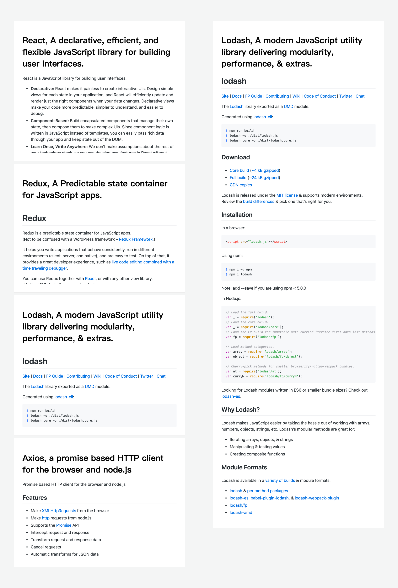

### 小结

通过搭建简易博客系统, 我们了解了 Serverless 的一种实践. 期间涉及了如何创建云函数, 介绍了本地 VSCode 云函数插件, 云函数自定义域名与 API 网关映射, 云数据库的创建与连接, 云函数的代码组织方式等. 整个过程都很轻量, 没有太多涉及服务端运维的内容. Serverless 的兴起, 会给我们的开发带来很大的便利. 后期各大云服务商也必将完善 Serverless 的服务, 带来更佳的 DevOps 体验. 

最后，让我们一起拥抱 Serverless ，动手实战吧~

### 完整Demo
公众号放外链，链接不出去，放公众号了。公众号回复 serveless ，即可获取完整Demo 代码～

### 最后
+ 欢迎加我微信(winty230)，拉你进技术群，长期交流学习...
+ 欢迎关注「前端Q」,认真学前端，做个有专业的技术人...

