# 2021 TWeb 腾讯前端技术大会精彩回顾

周日参加了 TWeb 腾讯前端技术大会, 这里根据自己的理解, 对部分主题进行总结回顾, 一些主题本文只是做概要性的介绍, 如果对主题感兴趣, 可以关注 "前端Q", 号内回复 tweb 领取大会全部 ppt.

我们来看第一个主题~

## 腾讯文档渲染优化之路

讲师: 肖骏 - 腾讯前端开发工程师

腾讯文档目前有 1.6 亿月活, 日活用户峰值超过了 1600 万, 它需要支撑起千人同时编辑, 极限情况下，需要支撑数十万行的数据渲染交互不卡顿.

讲师讲述了在河南暴雨汛情期间, 一份 "救命文档" 写下的民间史诗. 验证了腾讯文档的高性能以及重要性.

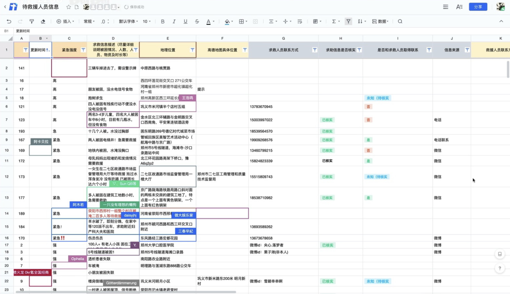

腾讯文档是怎么一步步优化性能的呢? 讲师从以下几步做了阐述

* dom 时代:
  * layout
    * 尽量避免改变元素的几何属性（例如宽度、高度、左侧或顶部位置等）
    * 修改“paint only”属性（例如背景颜色、文字颜色等）-> repaint
  * paint 优化
    * 使用will-change 或translateZ 等提升元素层级
    * 使用transform 和opacity 属性 
  * dom 滚动复用, 通过虚拟列表减少渲染的 dom 数量
* canvas 时代:
  * 单元格使用 canvas 渲染
  * 减少渲染时触发 GC
  * canvas 切换状态机优化
    * 遍历待绘制内容
    * 相同状态内容整理
    * 分类渲染
  * 离屏 canvas 与复用

讲师除了介绍腾讯文档的优化手段, 还介绍了如何精确、自动化地统计 FPS, 这里就不展开了, 详细的可以在 ppt 查看, 我们继续下一个主题~

## Flutter 音视频开发实践

讲师: 牛赞 - 腾讯前端高级工程师

根据 statista 和 stackoverflow 的统计数据, 今年 flutter 的热度已经超过了 react native.

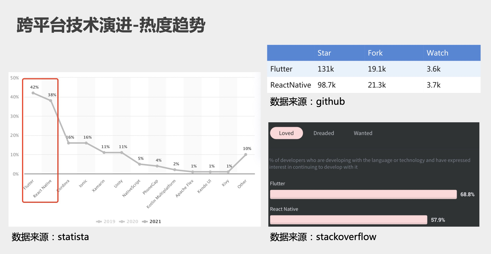

讲师介绍了 Flutter 的架构, Flutter 和 Web 开发的差异. 也介绍了腾讯实时音视频 TRTC（Tencent Real-Time Communication）在互动直播, 会议, 在线教育等场景的应用. 尤其在疫情期间, 是怎么助力线下业务搬到线上的.

期间, 讲师详细介绍了 TRTC 的架构, 以及 Flutter 在这个架构中扮演的角色.

最后, 讲师介绍了 TRTC Flutter 音视频的 SDK 设计, 主要围绕以下面临的几个挑战来阐述:

这些问题, 读者如果感兴趣, 可以获取到 ppt 后进一步了解~

我们来看下一个主题:

## 如何设计一门上万人使用的 DSL - 腾讯问卷 DSL 实践之路

讲师: 李泽帆 - 腾讯前端工程师

腾讯问卷的开发同学会做一些问卷的定制开发, 每份问卷, 和需求方沟通, 可能要 3 天时间才能开发完. 通常会出现如下情况:

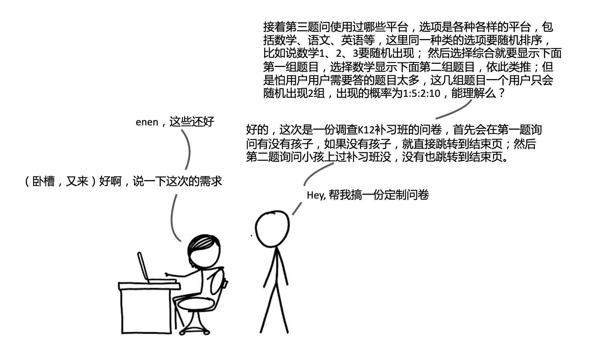
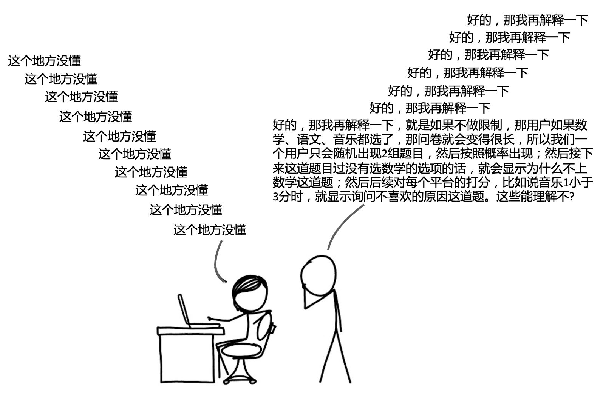

面对这种沟通成本巨大的场景, 需求方清楚地知道逻辑, 但不会写代码. 这种情况就适合用 DSL 来解决.

这里简单介绍下 DSL (Domain-specific language), 中文翻译为领域特定语言，例如 SQL、JSON、正则表达式等。与之形成对比的是 GPL（General Purpose Language），中文翻译为通用编程语言，我们熟悉的C、C++、JavaScript、Java 语言等就是。

DSL 有如下特点:

* 是一门便于人们理解的编程语言或规范语言，并且可以被计算机解释执行。
* 相比于通用编程语言，只能表达有限的逻辑。
* 因为受限的表达性，所以只会在某一些领域广泛应用。

我们来看一下腾讯问卷实现的 DSL

我们来简单了解下实现原理:

* 通过使用解析器生成器将 DSL 翻译成可执行的语句, 腾讯问卷使用了 PEG.js

来看一个案例, 如何通过 DSL 表述两分钟前:

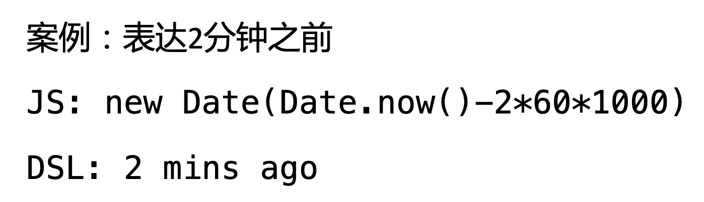

来看一下基于 peg.js 的实现:

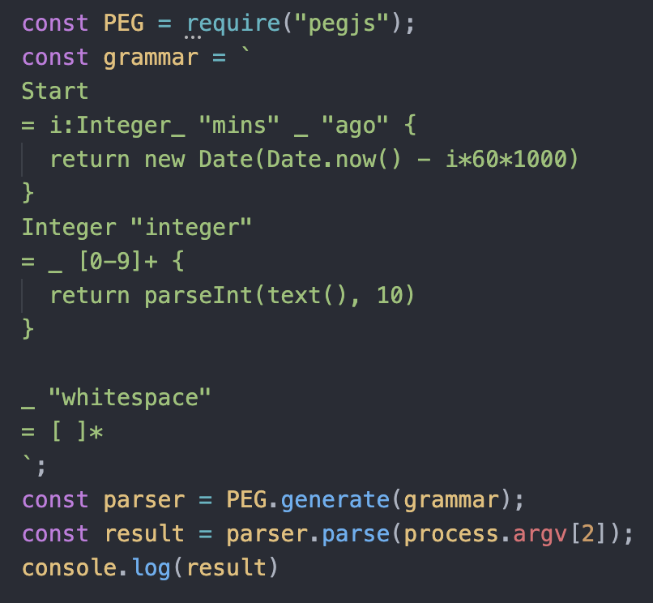

可以看到, 有了 PEG.js, 我们不需要了解编译原理, 就可以很好地完成一个简单的 DSL 语言的编写.

讲师除了介绍 DSL 的实现方法之外, 还介绍了怎么设计更容易被书写, 以及 DSL 利弊. 详情还是查看 ppt 啦~

## 远程办公下开发测试协同如何提效

讲师: 杨晨(腾讯前端工程师) & 吴文斌 (腾讯前端高级工程师(whistle 作者))

两位讲师主要介绍了一个基于【Whistle】的代理集成多种功能的免代理平台 TDE (Tencent Debugging Experience). 对于还不了解 whistle 是什么的同学, 可以点击这里了解(todo).

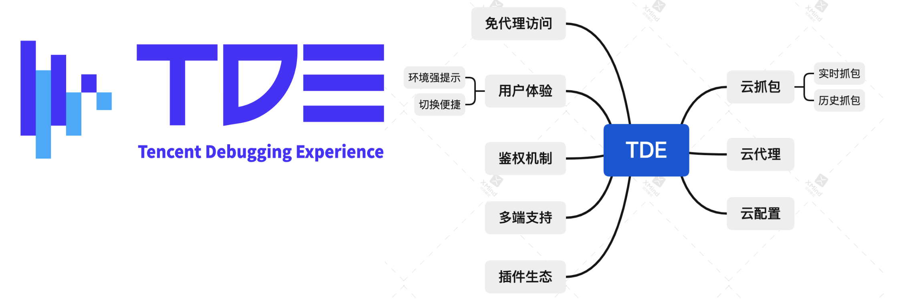

拥有了 TDE, 我们就可以不用在本地安装 whistle, 而是通过一套系统, 在被测界面上注入操作面板解决各种代理, 抓包问题. 比如切换环境只需要在被测界面的面板点一下. 另外就是可以做到云抓包, 比如开发可以抓到测试同学的包. 同时 TDE 也解决了我们的代理配置无法共享的问题:

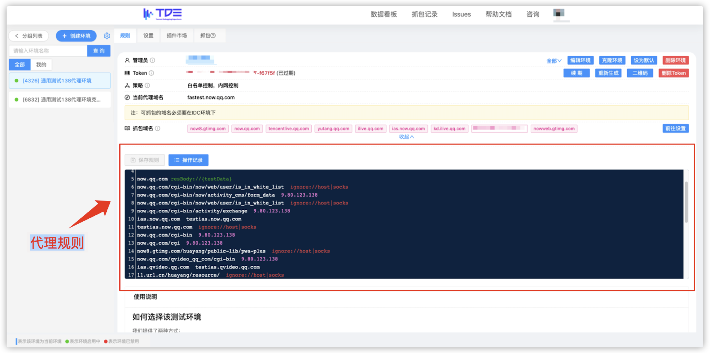

本次分享, 讲师还详细介绍了实现原理, 比如 whistle, nohost 的架构和实现细节, 安全机制等.

这个主题还是很多干货的, 大家感兴趣的话还是进一步查看 ppt 哈~

## Kubernetes 微服务体系下的便捷 BFF 开发

讲师: 王振威 - CODING 研发总监

讲师介绍了 BFF (Backend for Frontend) 的由来, 在没有 BFF 层时, 前端向后端请求数据, 会面临一个 N + 1 问题 (一个界面请求 N 个接口), 如:

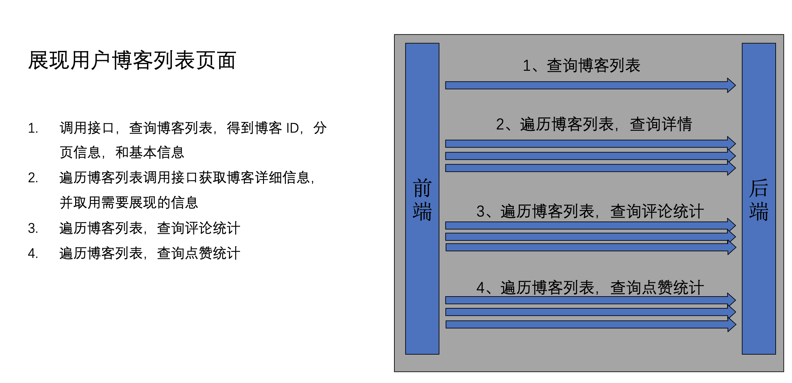

这是不合理的, 渲染一个博客列表, 不仅需要查询博客列表, 还需要查询博客详情, 另外还要再分别发请求获取博客的评论, 点赞信息的请求.

这里的本质问题是前端是界面思维, 后端是数据思维, 这么直接请求, 就会导致接口调用复杂失控, 不利于后期维护:

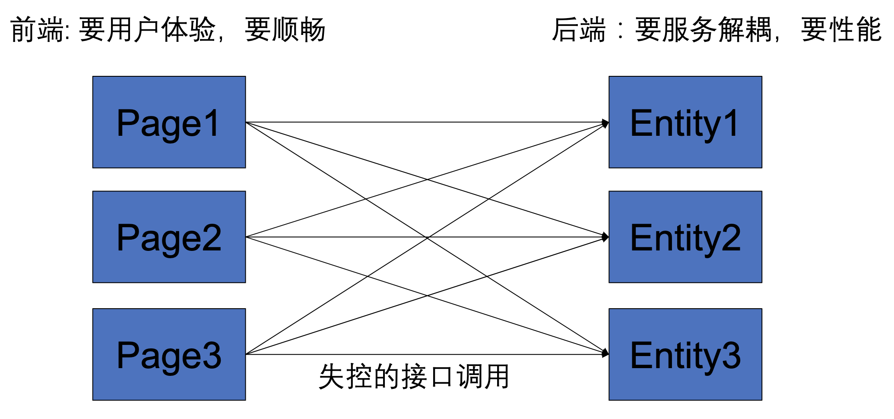

所以我们需要 BFF 层:

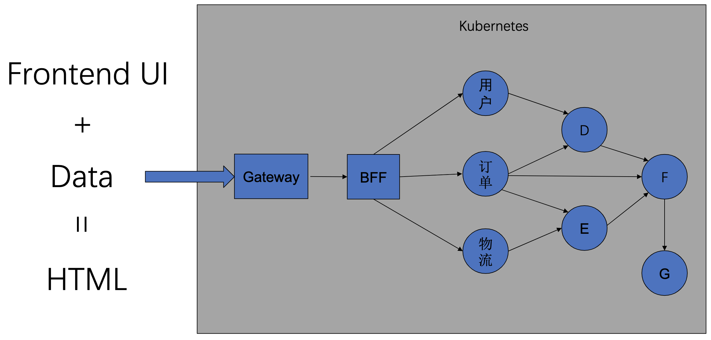

如此, 前端就不再需要请求 N 个接口, 而是将这部分工作交给了 BFF 层, 而 BFF 层请求 N 个接口, 不存在外网延时, 鉴权等问题, 服务更加可控和高效.

接着, 讲师介绍在 kubernetes 下, BFF 会面临以下问题:

* 环境搭建
  * 微服务数量多, 环境搭建复杂
  * 环境脆弱，易损坏
* 本地资源不够用
  * 微服务占用资源太多
* 编码自测循环耗时太久, 有些服务本地无法完成调试, 需要部署到开发或测试环境.

讲师介绍了通过 K8s 生态打造弹性环境体系来解决以上问题, 弹性环境体系可以确保每个人拥有云上独立的开发测试环境, 此外还可以通过 vscode 插件直连开发环境, 做到修改代码及时生效.

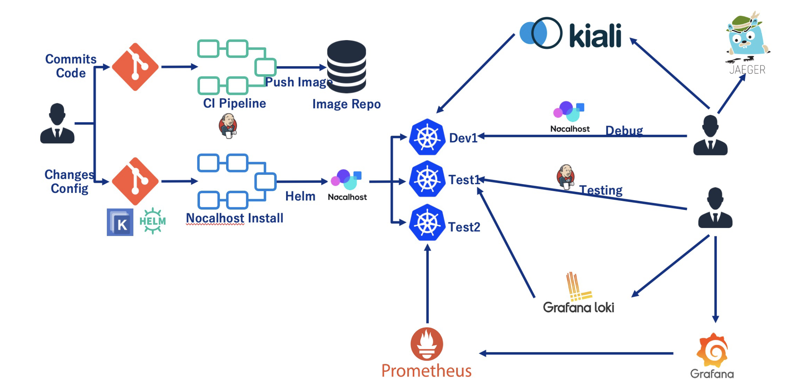

这一切, 都封装在背后, 对于开发者而言, 只是简单的改动代码, 环境, 资源都不需要考虑.

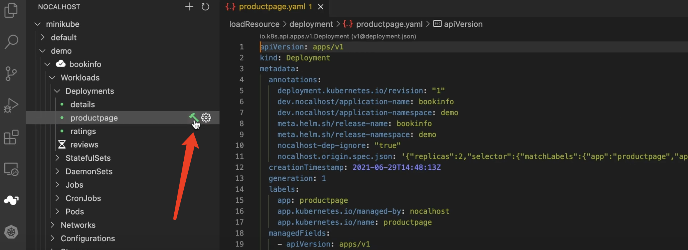

如上图, vscode 通过安装 nocalhost 插件, 点击开发环境右侧的小锤图标按钮, 即可在本地开发代码, 而这些代码, 包括 vscode 中的命令行, 都是一个云上的, 改完代码重启服务可以立即看到效果, 而无需等待漫长的 CI CD 流程.

如果大家想进一步了解 nocalhost, 可以观看如下视频, 或查看 ppt:

(todo 这个视频要上传, markdown 预览不了, 视频名称 nocalhost.mp4)

TWeb 还有很多主题这里没有介绍, 如低代码, 可视化, 跨端, 编辑器和效能方面的一些主题, 限于篇幅, 这里就不一一展开了, 大家可以关注 "前端Q", 号内回复 tweb 领取大会全部 ppt 进行学习哦~