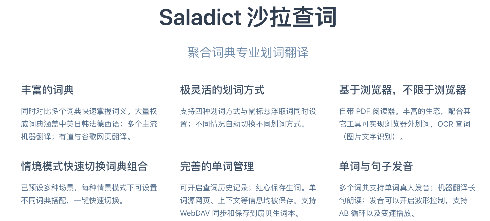
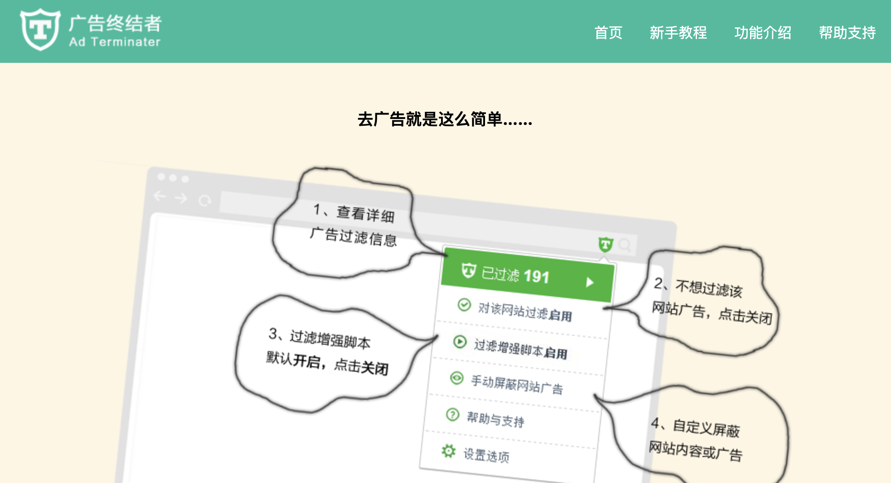
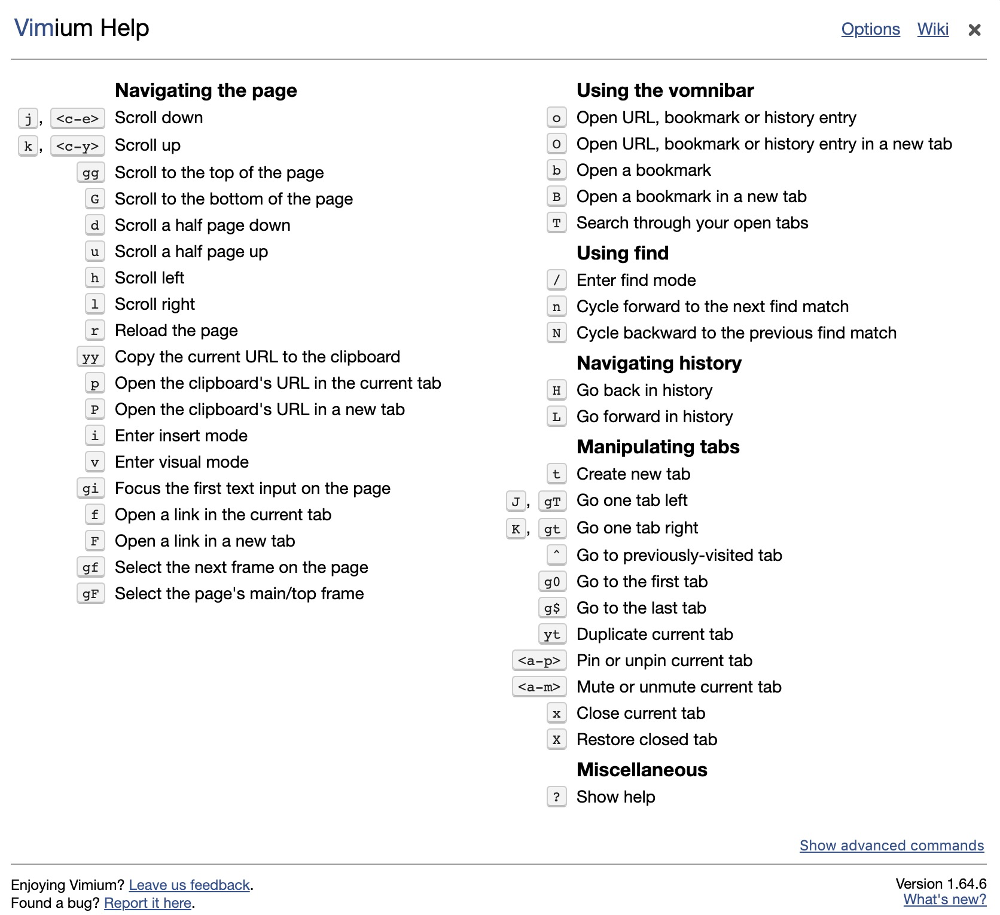
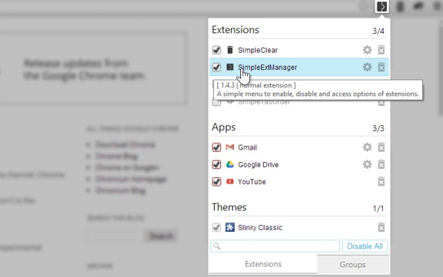
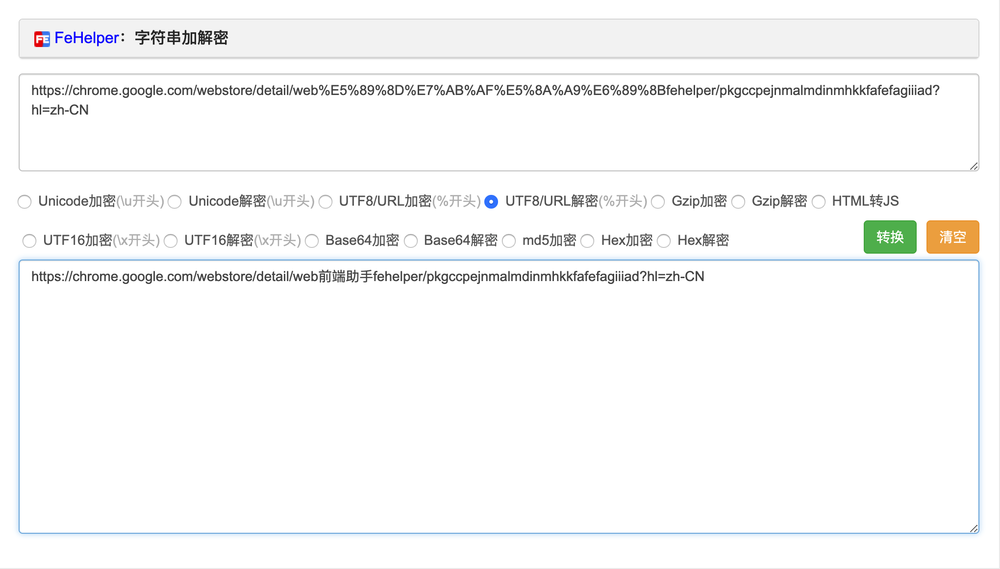
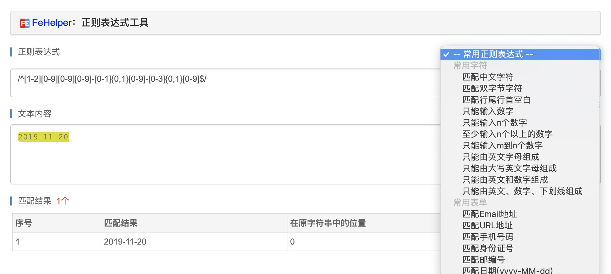
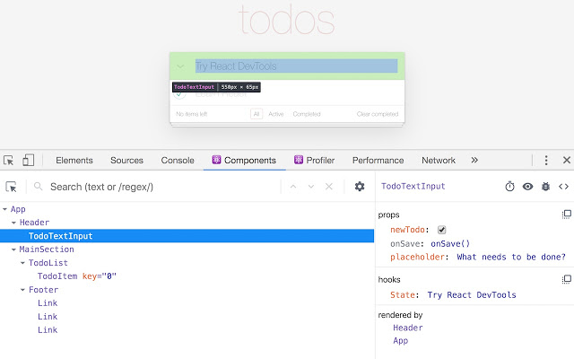
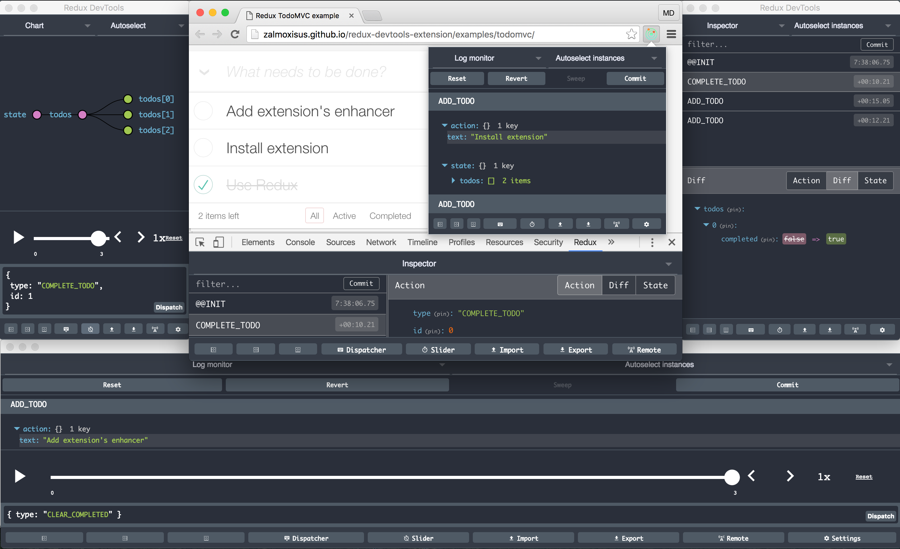
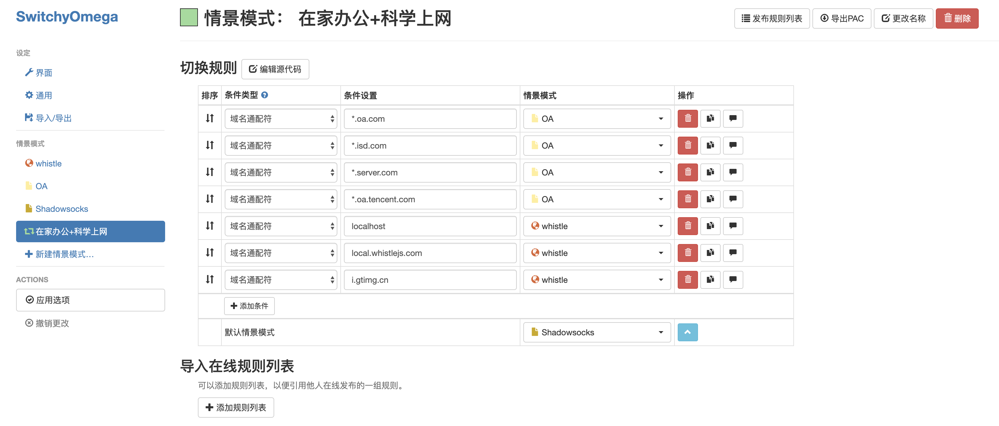

# 前端效能提升之不可忽略的 Chrome 插件

<!-- TODO: 这里要渲染一波啊, 说说现状, 为什么这么多人不会好好用插件 -->

Chrome 有丰富的插件, 可以扩展出很多功能, 提高我们的工作效率. 

这里给大家过滤了一些优质的插件, 包括三部分, 第一部分虽然与我们的开发不是直接相关, 但也会间接影响我们的效率, 第二部分就涉及到开发了, 用好了效率会有较大提升. 第三部分是插件的管理, 让你轻松禁用, 启用, 卸载, 分享插件.

此外, 因为有些同学不能科学上网, 我也会附上插件的 crx 包, 让你轻松下载与安装.

下面我们开始一一介绍

## 第一部分 (日常使用)

### 沙拉查词

这是 chrome 中最好的一款翻译插件, chrome 应用商店该插件下的好评如潮, 我们来看看基本上是这样的:

> 这插件真的是。。。有毒。。好用到停不下来。。。强大 方便 有颜值，拯救了读文献的底层劳动人民  

> 这是我用过最好的翻译软件，不仅可以随时记录每个翻译单词到生词本，而且可以选择不同的翻译途径。棒棒棒！！！

> 一直在找一个好用的翻译插件，这么多年终于遇到一个了，感动的涕泗横流。5星推荐~~

> 好用，易用，图标设计好看，图标的小动画很可爱，动效很酷！推荐七大姑八大姨也来用，英文学习好帮手(๑•̀ㅂ•́)و✧

他的功能也十分丰富, 这里引用官网的介绍:

查词时, 优秀的交互体验与完善的功能:

### Full Page Screen Capture (全网页截屏)

该插件可以将整个网页截成一张长图, 并且支持编辑, 有时我们不方便分享网页时, 比如一些内网站点外网访问不了, 通过全网页截屏就是一个很好的办法.

### 广告终结者

国内用户推荐使用广告终结者, 它可以有效拦截我们常访问的网站, AD BLOCK PLUS 在部分国内常用网站上拦截无效

### Infinity 新标签页

替换 chrome 原有首页的一个选择, 功能完善, 可以管理方便的管理和查找书签, 每天更换一个壁纸, 点击下边的小风车, 可以随机切换壁纸

不仅如此, 点击右上角的 + 号, 可进行登录, 常规, 外观, 壁纸设置, 还可以对标签页的图标进行整理替换

### Momentum

是另一款替换 chrome 原有首页的插件, 简介大气, 左上角可以搜索, 右上角展示天气, 中间展示时间, 下方默认有个 todo 的功能, 左下角可以对标签页进行设置, 新增一些功能, 比如展示一条短语来建立积极的心理习惯.

### Vimium - The Hacker's Browser

vimium = vim + chromium, vim 是 linux 自带的文本编辑器, 通过各种快捷键, 完全脱离鼠标操作, 而 vimium 则继承了 vim 的常用快捷键, 让你脱离鼠标操作 chrome. 如果你够 hacker, 你会爱上他.

下面说一些常用的快捷键

| 快捷键 | 作用 |
|:----:|:----:|
|j| 向下滑动网页 |
|k| 向上滑动网页 |
|u| 向上翻一页 |
|d| 向下翻一页 |
|gg| 返回页面顶部 |
|G| 移动到页面底部 |
|H|历史上一页|
|L|历史下一页|
|B|从书签中选择, 在新标签页打开|
|T|从打开的标签中搜索|
|r|刷新页面|
|F| 将网页内可点击部分标记为选择状态, 最终在新标签页打开|

f 的效果如下

注意到顶部的搜索栏, 我们输入 SC, 就可以 focus 到输入框, 输入要搜索的内容, 回车即可完成搜索, 如果想要退出这个模式, 按 esc 即可

如果要打开掘金首页, 我们输入 DA 即可

更多的用法, 我们输入 ?, 即可呼起帮助弹框, 只要记住该操作, 再也不会忘记快捷键~

### crxMouse Chrome™ 手势

这个插件与 vimium 相反, 增强了鼠标的功能, 看到身边挺多人在用, 体验了一下, 还不错, 这里推荐给快捷键不敏感人群~

如果要在新标签页打开一个链接, 在链接上方, 按住鼠标向左拖动即可

如果要返回历史上一页, 在空白处向左拖动即可

此外, 还有下一页, 关闭标签页, 重新打开标签页, 自定义行为等, 感兴趣的可以看官方介绍视频:

<!-- TODO: 这里要有个视频  -->

### SimpleExtManager (插件管理)

这是一款可以管理插件的插件, 让你方便地禁用, 启用和删除插件, 当插件多起来的时候, 会影响 chrome 的速度, 为了在需要某个插件时, 能快速的启动某个插件, SimpleExtManager 就必不可少了

## 第二部分 (协助开发)

接下来这一部分和我们的开发息息相关啦, 话不多说, 我们开始吧

### FeHelper

FeHelper 由 Alien 开源, 是一款前端工具集大成的插件, 前端开发必备. 

先祭出官网介绍的功能菜单感受一下:

挑几个功能介绍一下

* 字符串加解密

如下图, 这里提供了各种加解密的方法, 拿简单的 UTF8/URL解密来看, 可以很方便地看清一个带有中文的 url 参数

* JSON 格式化

如下图, 格式化后, 可以点击某个节点进行下载或复制, 此外, 如果你在浏览器地址栏访问一个 get 请求, 返回的 JSON 数据也会被默认格式化. 

* 二维码生成工具

右键打开菜单, 点击 FeHelper 的二维码生成器, 即可生成当前页面的二维码, 可以配置自定义图标, 另外还可以改动 url 进行实时编辑, 调试页面的时候在 pc 打开, 生成二维码后, 就不用手动在手机输入 url 了~

* 正则表达式工具

可以帮助生成常用的正则表达式, 可以看表达式是否匹配, 在正则调试过程中可以起到较好地辅助作用

关于 FeHelper 更多地内容, 安装后体验一下吧~

### Window Resizer

如果开发时, 用的是大显示屏, 那么你可能不能很好地兼容小屏幕笔记本, Window Resizer 可以让你方便地将浏览器调整到任意尺寸, 这些尺寸是包括 chrome 导航栏和书签栏的, 比如调整到大部分笔记本电脑的尺寸 1366 * 768:

### React Developer Tools

当我知道有 react 开发者竟然不会使用这个 react 开发工具时, 也是一脸震惊. 现在推荐的 React Developer Tools 是官方维护的一个 react 开发辅助工具, 他能让你像审查元素一样, 审查 react 组件, 看到 react 组件的 state, props, state, props 也可以修改实时修改, 触发 react 重复渲染.

### Redux DevTools

Redux 是一个状态容器, 提供可预测化的状态管理, 在 react 中被广泛使用, 通常情况下, 复杂的数据流管理使用 redux 是一个不错的方案.

Redux DevTools 让我们方便地追踪数据流的变化, 看到每一个改变是由哪个 action 带来的. 还能清晰地看见整个 store 的情况, 根据数据流记录, 让应用的状态回到某个时间节点.

<!-- TODO: 这里有个 redux-1.pm4 -->

### Vue.js devtools

同样, Vue 也有优秀的开发工具, 依然能展示和操作组件当前的数据, 触发双向绑定的 view 更新, 功能很完善. 个人认为界面更加清晰好看一些~

### SwitchyOmega

一款浏览器代理工具, 可以让你浏览器的请求代理都指定的服务, 比如将所有请求指向 whistle, 将 *.oa.com 的服务指向内网, 将你需要的请求指向科学上网的代理服务, 让你轻松应对复杂的网络环境.

### Octotree

让浏览 github 代码变得像本地编辑器一样轻松, 可以搜索文件, 点击代码目录跳转等, 方便地在文件之间切换 

## 小结

工欲善其事必先利其器, 对于这种经过短期学习, 就能为后期开发带来很大便利的事情, 笔者都会刻意练习做到孰能手巧. 以上插件都是本人体验过能较大程度上提升开发效率的, 大家快点用起来吧~

关注前端Q号内回复插件, 领取所有推荐插件安装包
